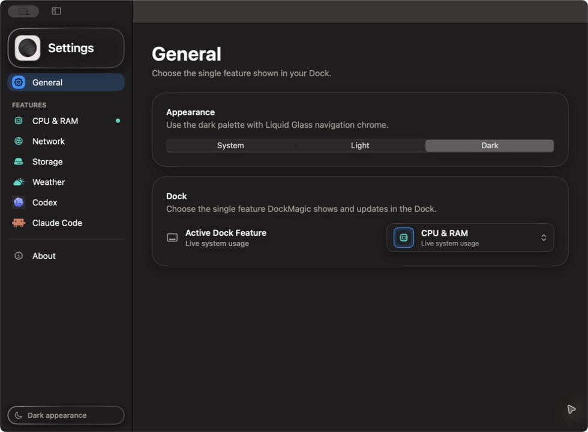
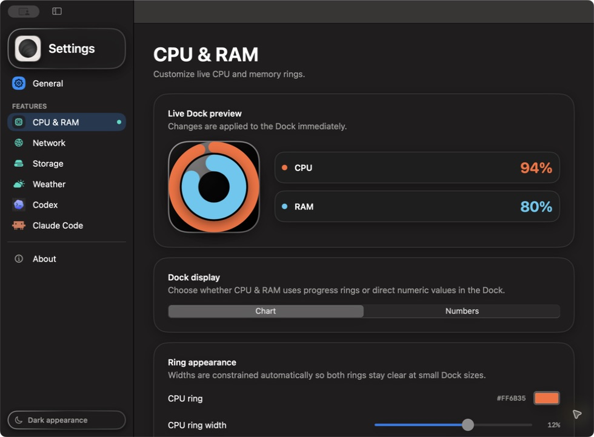
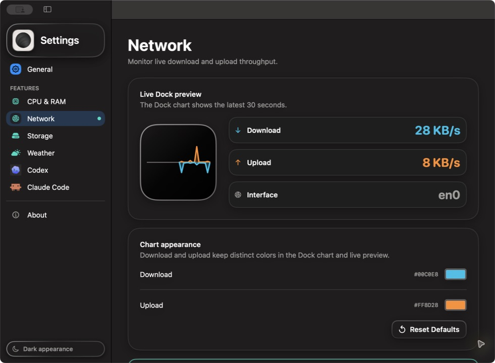

<div align="center">
  
  <h1>DockMagic</h1>
  <p><strong>A live, glanceable status display for your macOS Dock.</strong></p>
</div>

DockMagic is a native macOS app that turns its own Dock icon into a small,
live status display. It keeps one feature active at a time so the Dock remains
glanceable and background work stays bounded.

DockMagic does not add a menu bar item. Click the Dock icon or press `Command-,`
to open its single Settings window.

## Contents

- [Screenshots](#screenshots)
- [Features](#features)
- [Privacy and distribution](#privacy-and-distribution)
- [Requirements](#requirements)
- [Getting started](#getting-started)
- [Build and test](#build-and-test)
- [Project structure](#project-structure)
- [Contributing](#contributing)
- [Reporting bugs and security issues](#reporting-bugs-and-security-issues)
- [License](#license)

## Screenshots

<p align="center">
  <a href="docs/screenshots/dockmagic-general-dark.jpg">
    
  </a>
</p>
<p align="center">
  <sub>Select one active Dock feature and choose the app appearance.</sub>
</p>

<table>
  <tr>
    <td width="50%">
      <a href="docs/screenshots/dockmagic-cpu-ram-dark.jpg">
        
      </a>
    </td>
    <td width="50%">
      <a href="docs/screenshots/dockmagic-network-dark.jpg">
        
      </a>
    </td>
  </tr>
  <tr>
    <td align="center">
      <strong>CPU &amp; RAM</strong><br />
      <sub>Live system usage with a size-aware Dock preview.</sub>
    </td>
    <td align="center">
      <strong>Network</strong><br />
      <sub>Live download and upload throughput for the primary interface.</sub>
    </td>
  </tr>
</table>

Screenshots show Dark appearance. Live values vary by Mac and capture time.
Click any screenshot to view it at full resolution.

## Features

- **DockMagic** displays the DockMagic logo without running a metrics provider.
- **CPU & RAM** displays system-wide CPU usage in the outer ring and used RAM
  in the inner ring. Both values are sampled locally at `1 Hz`. Its Dock-hover
  dashboard adds separate Top 10 process lists for normalized whole-machine CPU
  and physical memory footprint, plus a dual-series 60-second realtime chart.
- **Network** charts traffic for the primary network interface, with upload
  above and download below the baseline. Both directions share a linear scale
  that expands with traffic. The Dock keeps the latest 30 samples, while the
  sampler keeps up to 60 in-memory samples at `1 Hz`.
- **Storage** displays used capacity on the startup volume and refreshes locally
  every five seconds.
- **Weather** renders the current temperature and condition for Dock sizes from
  `32...128 pt`; larger tiles also show the daily high and low. It uses the
  current macOS location, refreshes from Open-Meteo every ten minutes while
  active, reverse-geocodes the place name, opens a seven-day forecast dashboard
  when the Dock tile is hovered, and retains the most recent successful result
  if a refresh fails.
- **Clock** renders Analog, stacked Digital, or Split-flap time directly in the
  Dock. It follows the Mac's current time zone by default, can use another IANA
  city/time zone without changing system settings, and requires no network or
  additional Location permission. Digital rolls the changed row and Split-flap
  mechanically flips only changed digits at each minute boundary; both settle
  immediately when Reduce Motion is enabled. Clock is intentionally Dock-only
  and never opens a hover dashboard.
- **GitHub** displays repository stars and forks as a compact line chart or
  numeric tile. It refreshes the active repository every 15 minutes, retains up
  to seven days of count history, and uses conditional ETag requests. Public
  repositories work without authentication; an optional fine-grained personal
  access token enables private repositories and a higher rate limit.
- **Codex** displays the remaining five-hour and weekly usage windows. When
  selected, DockMagic locates the installed Codex CLI and calls
  `codex app-server --stdio` with the existing login. If the account does not
  return a five-hour window, DockMagic displays only the weekly value instead
  of inventing missing data.
- **Claude Code** displays five-hour and weekly windows plus real local token,
  model, observed-cost, context, subagent, task, goal, and Ship momentum data.
  DockMagic uses Claude Code's official `statusLine` and `subagentStatusLine`
  contracts together with local transcript metadata. Selecting the feature installs the
  default local bridge automatically, preserves any previous status-line
  command, and does not call internal OAuth endpoints. Its Dock-hover dashboard
  shows quota, a Tokens/Cost chart, top models, Ship momentum, and active work.
  Missing or partial observations remain visibly unavailable instead of being
  estimated from fabricated prices or activity.
- **General settings** select exactly one feature to run and display in the
  Dock. CPU & RAM, Storage, GitHub, Codex, and Claude Code support `Chart` and
  `Numbers` display styles; Clock offers `Analog`, `Digital`, and `Split-flap`
  in both General and Clock Settings. Colors and display choices are persisted
  and applied to the active tile immediately.
- **Appearance** supports System, Light, and Dark. Navigation chrome uses Liquid
  Glass where available and a material fallback on the current toolchain, while
  primary content remains opaque.

The default color for both Claude Code rings is the coral `#D97757` sampled from
the provided Claude Code logo. Users can still customize each ring separately.

## Privacy and distribution

DockMagic is designed for direct distribution, not the Mac App Store.

- CPU & RAM, Network, and Storage data is processed only on the Mac. CPU & RAM
  process names, PIDs, rankings, and 60-second history remain in memory and are
  neither persisted nor logged. Processes macOS does not allow DockMagic to
  inspect are skipped without requesting another permission. Network history
  also remains in memory and is not persisted.
- Weather sends the current coordinates to Open-Meteo over HTTPS and stores only
  the last successful snapshot for failure recovery. It does not keep location
  history. macOS requests Location permission through the standard system
  prompt.
- GitHub receives the configured `owner/repository` path over HTTPS every 15
  minutes while the feature is active. DockMagic stores only count snapshots,
  timestamps, and the response ETag for up to seven days. An optional access
  token is stored only in macOS Keychain and is never written to preferences or
  history.
- The Codex integration does not read or store authentication tokens, prompts,
  answers, or account identifiers. It reads rate-limit and aggregate usage
  responses from the installed Codex CLI. When that aggregate omits the current
  day, DockMagic reads only local `token_count` metadata from the relevant Codex
  session files to fill today's usage; it does not inspect conversation text.
- Claude Code bridge snapshots and per-session observations stay under
  `~/.claude/` with private permissions. DockMagic reads transcript metadata
  needed for usage, model, task, and active-goal aggregation; it ignores prompt
  and answer text except explicit task descriptions and goal objectives. It
  never reads Claude Code OAuth tokens. The only Keychain secret managed by the GitHub feature is the
  optional token entered by the user.

The core Dock renderer does not require Accessibility, Screen Recording, Full
Disk Access, or administrator privileges. The optional Dock-hover dashboard
requires Accessibility only to detect DockMagic's own hovered Dock icon and its
position. Weather requires Location Services and network access.

Production releases must use Developer ID signing, Hardened Runtime,
notarization, stapling, and a Gatekeeper smoke test on a clean Mac. Contributions
must not introduce Mac App Store-only packaging or capabilities unless the
direct-distribution impact has been evaluated and documented.

## Requirements

- macOS 14.0 or later
- Xcode 15.4 or later
- Swift 5
- Location Services and a network connection only when using Weather; see the
  [Open-Meteo integration contract](docs/WEATHER_OPEN_METEO.md)
- A network connection when using GitHub; a token is optional for public
  repositories and required for private repositories
- An installed Codex CLI only when using Codex
- An installed Claude Code CLI only when using Claude Code; `rate_limits`
  requires a supported subscription and at least one response after automatic
  bridge setup

DockMagic is an Xcode project, not a Swift Package. It currently has no external
package dependencies.

## Getting started

1. Fork the repository on GitHub, then clone your fork:

   ```bash
   git clone https://github.com/YOUR-USERNAME/dockmagic.git
   cd dockmagic
   git remote add upstream https://github.com/thanhdongnguyen/dockmagic.git
   ```

2. Open `DockMagic/DockMagic.xcodeproj` in Xcode.
3. Select the `DockMagic` scheme and the **My Mac** destination.
4. Build with `Command-B`, or use the unsigned command below for a build-only
   verification.

The Xcode project contains the maintainer's development-team setting. If Xcode
asks for a signing identity, select your own team locally. Do not include
personal signing changes in a pull request.

## Build and test

### Build and launch

The helper script builds into `.derivedData`, stops an existing DockMagic
process, and launches the Debug app using the project's current signing setup:

```bash
./script/build_and_run.sh
./script/build_and_run.sh --verify
```

Other supported modes are `--debug`, `--logs`, and `--telemetry`:

```bash
./script/build_and_run.sh --logs
```

For an unsigned build-only check, run:

```bash
xcodebuild \
  -project DockMagic/DockMagic.xcodeproj \
  -scheme DockMagic \
  -configuration Debug \
  -destination 'platform=macOS' \
  -derivedDataPath /tmp/DockMagicDerivedData \
  CODE_SIGNING_ALLOWED=NO \
  build
```

### Unit tests

Unit tests can use an unsigned build:

```bash
xcodebuild \
  -project DockMagic/DockMagic.xcodeproj \
  -scheme DockMagic \
  -destination 'platform=macOS' \
  -derivedDataPath /tmp/DockMagicUnitTests \
  CODE_SIGNING_ALLOWED=NO \
  -only-testing:DockMagicTests \
  test
```

### UI tests

macOS UI tests require a valid Apple Development signing identity. Do not add
`CODE_SIGNING_ALLOWED=NO`; AppleSystemPolicy will otherwise block the XCUI
runner.

```bash
xcodebuild \
  -project DockMagic/DockMagic.xcodeproj \
  -scheme DockMagic \
  -destination 'platform=macOS' \
  -derivedDataPath /tmp/DockMagicUITests \
  -only-testing:DockMagicUITests \
  test
```

Use a separate Derived Data directory for each build or test lane. Concurrent
commands that share one directory can contend for `build.db` and produce
misleading failures.

## Project structure

| Path | Responsibility |
| --- | --- |
| `DockMagic/DockMagic/App` | App lifecycle and scene composition |
| `DockMagic/DockMagic/Models` | Feature configuration and immutable snapshots |
| `DockMagic/DockMagic/Services` | System samplers, external providers, and Dock integration |
| `DockMagic/DockMagic/Stores` | Observable state, polling lifecycle, and persistence coordination |
| `DockMagic/DockMagic/Views/Dock` | Size-aware Dock tile renderers |
| `DockMagic/DockMagic/Views/Settings` | Settings navigation and feature controls |
| `DockMagic/DockMagic/DesignSystem` | Semantic tokens and shared components |
| `DockMagic/DockMagicTests` | Unit, rendering, privacy, and integration-contract tests |
| `DockMagic/DockMagicUITests` | Signed end-to-end Settings tests |
| `docs` | Architecture and feature-specific design contracts |
| `script` | Local build and asset-generation utilities |

Read the following documents before changing the corresponding subsystem:

- [Architecture](docs/ARCHITECTURE.md)
- [Design system](docs/DESIGN_SYSTEM.md)
- [Color design system](docs/COLOR_DESIGN_SYSTEM.md)
- [Sigma-inspired design-system mapping](docs/SIGMA_DESIGN_SYSTEM.md)
- [Weather and Open-Meteo](docs/WEATHER_OPEN_METEO.md)
- [Claude Code usage integration](docs/CLAUDE_CODE_USAGE.md)

## Contributing

Contributions are welcome. Small fixes can go directly to a pull request. Open
an [issue](https://github.com/thanhdongnguyen/dockmagic/issues) before investing
in a large feature, a new external service, a new entitlement, a persistence
change, or a release/distribution change. Early discussion helps confirm that
the proposal fits DockMagic's focused Dock-tile model and privacy boundary.

### Development workflow

1. Check existing issues and pull requests to avoid duplicate work.
2. Create a focused branch from the repository's default branch:

   ```bash
   git fetch upstream
   git switch -c feature/short-description upstream/main
   ```

3. Make one coherent change. Avoid unrelated formatting or generated-file
   churn.
4. Add or update tests for behavior changes. Update documentation when a user
   flow, privacy boundary, dependency, permission, or architecture contract
   changes.
5. Run the relevant build and test commands from this README. Also run:

   ```bash
   git diff --check
   ```

6. Push the branch to your fork and open a pull request against `main`.

### Engineering guidelines

- Preserve the **single active feature** contract. Inactive providers and
  samplers must stop rather than continue polling in the background.
- Keep the long-lived `DockTileController` ownership model. Update its existing
  presentation and explicitly redraw the `NSDockTile`; do not create a new
  controller for every sample.
- Keep UI-facing mutable state on `@MainActor`. Prefer immutable, `Sendable`
  snapshots at concurrency boundaries and dependency injection for testable
  providers.
- Use public macOS APIs that support Developer ID distribution. Explain any new
  entitlement, permission, network request, on-disk data, or third-party
  service in both tests and documentation.
- Keep monitoring local by default and collect only the minimum data required.
  Never commit credentials, tokens, personal paths, transcripts, or private
  sample payloads.
- Use semantic colors and shared components from `DesignSystem` instead of
  introducing one-off visual constants. Follow the color budget in
  `docs/COLOR_DESIGN_SYSTEM.md`: neutral-first, one action accent, conditional
  semantic color, monochrome interface icons, and no product gradients. Verify
  UI changes in System, Light, and Dark appearances, at small Dock sizes, and
  with relevant accessibility settings.
- Preserve existing accessibility labels and identifiers. Add them for new
  interactive controls and non-text status states.
- Follow the existing Swift style: four-space indentation, descriptive names,
  small focused types, and no unrelated refactors in a feature pull request.
- Do not commit `.derivedData`, local Xcode user data, build products, logs, or
  signing-only project changes.

### Pull request checklist

A pull request should include:

- A concise explanation of the problem and the chosen solution.
- The user-visible behavior and any privacy, performance, permission, or
  distribution impact.
- Tests added or updated, plus the exact commands run and their results.
- Screenshots or a short recording for visible Settings or Dock changes. Include
  the tested appearance, Dock size, and macOS version.
- Documentation updates for changed contracts or contributor workflows.
- A focused diff with no secrets, personal signing settings, or unrelated
  generated changes.

Not every change needs every test suite. State clearly what was and was not
verified so reviewers can distinguish source review, unit tests, builds, UI
tests, and manual Dock inspection.

### Community expectations

Be respectful, constructive, and specific. Discuss the work rather than the
person, assume good intent, and make space for contributors with different
levels of experience. Harassment, discrimination, and disclosure of another
person's private information are not acceptable. A standalone
`CODE_OF_CONDUCT.md` has not yet been published; maintainers should add one
before growing the contributor community.

## Reporting bugs and security issues

Use [GitHub Issues](https://github.com/thanhdongnguyen/dockmagic/issues) for
reproducible bugs and feature requests. A useful bug report includes:

- macOS and Xcode versions;
- Dock position, size, magnification, and appearance when visually relevant;
- the active DockMagic feature and display style;
- exact reproduction steps, expected behavior, and actual behavior;
- relevant logs with tokens, usernames, coordinates, and personal paths
  removed; and
- screenshots or a minimal sample when appropriate.

Do not publish credentials, tokens, precise location data, or an exploitable
security report in a public issue. This repository does not yet provide a
`SECURITY.md` or a documented private reporting address. Until one is added,
contact the [repository owner](https://github.com/thanhdongnguyen) privately
through an available GitHub contact method and disclose only the minimum detail
needed to establish a secure channel.

## License

This repository does not currently include a software license. Until the
maintainers add one, standard copyright restrictions apply: source availability
alone does not grant permission to use, modify, or redistribute the code. An
[OSI-approved license](https://opensource.org/licenses) should be selected and
added before DockMagic is described or distributed as open-source software.
