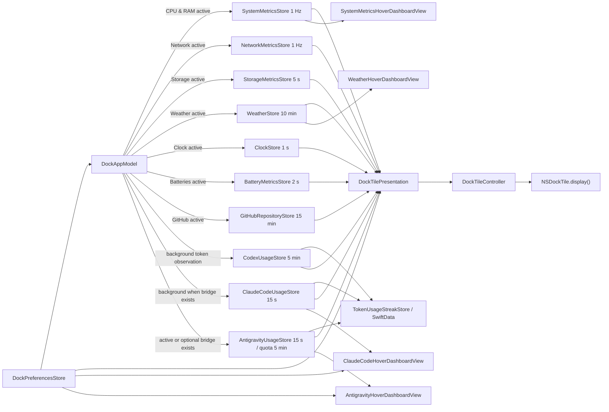

# DockMagic Architecture

## 1. Product contract

DockMagic is a `.regular` macOS application: its Dock icon is both the display
surface and the entry point for opening Settings. There is no `MenuBarExtra`,
`NSStatusItem`, secondary dashboard, or placeholder logo. The app continues
running after Settings closes so the Dock tile can keep updating.

Settings uses a native `NavigationSplitView`:

- `General`: select exactly one active feature.
- `CPU & RAM`: preview, colors, and widths for the two rings.
- `Network`: live preview, current download/upload/interface, and colors for
  the two series.
- `Storage`: live preview, used/available/total capacity, and color/width for
  one ring.
- `Weather`: responsive preview with location name, freshness state, and
  Open-Meteo attribution; there is no connection or Location/privacy section.
- `Clock`: live Dock preview, Analog/Digital/Split-flap style, and a choice
  between the Mac's current time zone and another IANA city/time zone. It has
  no hover dashboard.
- `Batteries`: live 2×2 Dock preview plus the Mac and every connected accessory
  for which macOS currently publishes battery data.
- `Codex`: quota preview, display style, colors, and widths for the two rings;
  there are no connection controls.
- `Claude Code`: quota preview, display style, colors, and widths for the two
  rings; there are no connection controls.
- `Antigravity`: a Claude Code-style authentication card backed by an embedded
  official `agy` session, structured model-pool quota from the CLI, shared
  display controls, and no local session metrics setup section. Existing
  DockMagic-owned `statusLine` connections remain observable, but Settings
  does not manage them; authentication state is not overlaid on the Dock
  preview.

## 2. Ownership

| Owner | Responsibility |
| --- | --- |
| `DockMagicApp` / `AppDelegate` | Scene graph, activation policy, and app lifecycle |
| `SettingsWindowRouter` | Focuses or opens one Settings window; Dock reopen and `⌘,` share this path |
| `DockAppModel` | Composition root; runs the selected Dock feature plus provider-independent token streak collection |
| `DockPreferencesStore` | Persists the feature, renderer appearance, and Codex executable override |
| `SystemMetricsStore` | `1 Hz` sampling loop, host history, process rankings, and independent error state |
| `SystemMetricsSampler` | Reads Mach CPU/VM counters; does not own UI |
| `SystemProcessMetricsSampler` | Reads per-process CPU time and physical footprint through local `libproc`; inaccessible processes are skipped |
| `SystemMetricsHoverDashboardView` | Renders Top 10 CPU/RAM rankings and a 60-second dual-series chart from store state |
| `NetworkMetricsStore` / `NetworkMetricsSampler` | `1 Hz` sampling, up to 60 history samples, and byte-counter deltas for the primary interface |
| `StorageMetricsStore` / `StorageMetricsSampler` | Polls the startup volume every 5 seconds and calculates used/available/total capacity |
| `WeatherStore` | Polls every 10 minutes, caches the snapshot, and owns live/stale/unavailable state |
| `OpenMeteoWeatherProvider` | Obtains Core Location, calls the Forecast API, validates HTTP/JSON, and maps WMO codes |
| `WeatherHoverDashboardView` | Renders current conditions, today's details, and the seven-day forecast inside shared Dock-hover chrome |
| `ClockStore` | Owns the lightweight local timer, immediate wake refresh, and start/stop lifecycle |
| `BatteryMetricsStore` | Re-enumerates live battery sources every 2 seconds and replaces disconnected devices atomically |
| `SystemPowerSourceBatteryReader` | Reads the Mac's internal battery through public `IOPowerSources` APIs |
| `IORegistryAccessoryBatteryReader` | Reads currently registered Bluetooth/USB accessory battery properties through public IOKit registry APIs |
| `GitHubRepositoryStore` | Polls the selected repository every 15 minutes, owns history/error/rate-limit state, and persists the bounded cache |
| `GitHubRepositoryAPIClient` | Calls GitHub's repository endpoint, decodes star/fork counts, and handles ETag and rate-limit headers |
| `KeychainGitHubCredentialVault` | Stores or deletes the optional GitHub access token in macOS Keychain |
| `CodexUsageStore` | Polling lifecycle, live/stale/unavailable state, and Codex token observations for the local streak ledger |
| `CodexAppServerRateLimitProvider` | Resolves the CLI, communicates with `codex app-server` over JSON-RPC, and parses quotas |
| `ClaudeCodeUsageStore` | Polls the local snapshot, owns freshness state, and supplies Claude Code token observations for the local streak ledger |
| `TokenUsageStreakStore` | Owns the separate Codex/Claude Code SwiftData day ledgers and derives current streak, best streak, recent days, and badges |
| `ClaudeCodeStatusLineBridge` | Installs/removes the status-line wrapper and preserves the previous configuration |
| `ClaudeCodeStatusLineRateLimitProvider` | Reads and parses only the local `rate_limits` cache |
| `ClaudeCodeHoverDashboardView` | Renders quota rows, next reset, snapshot freshness, and all availability states without reading private session data |
| `AntigravityUsageStore` | Polls official model-pool quota, ingests optional status-line observations, owns freshness, and derives bounded partial daily usage |
| `AntigravityCLIUsageProvider` | Resolves `agy`, launches the fixed documented `/usage` command, and schema-gates structured quota buckets without parsing prose |
| `AntigravityConnectionSettingsView` | Presents missing-CLI, signed-out, connected, stale, and failed outcomes while automatic checking stays background-only; hosts the unmodified interactive `agy` session for browser sign-in and keeps fixed-command sign-out non-interactive |
| `AntigravityStatusLineBridge` / `AntigravityStatusLineReader` | Preserve the prior command, write/read only allowlisted private snapshots, and hash raw session identifiers |
| `AntigravityHoverDashboardView` | Renders all quota pools plus clearly labelled partial local context, activity, and streak observations |
| `DockTileController` | Renders the canonical high-resolution application icon, publishes minute-boundary Clock animation frames, and calls `NSDockTile.display()` |
| `DockMetricsView` / `DockNetworkView` / `DockStorageView` / `DockWeatherView` / `DockClockView` / `DockBatteryView` / `DockGitHubView` / `CodexDockView` / `DockAntigravityView` | Pure renderers driven by input models and appearance |
| `SettingsView` | Preference UI; does not create timers or call Mach APIs |
| `DesignSystem` / `ProjectTheme` | Tokens, components, semantic palette, and appearance-aware theme root |

Process-lifetime owners are created exactly once in `AppDelegate`. Feature
views do not create local stores, which would cause duplicate timers or polling
and allow the Dock to fall out of sync with Settings.

The design system supports three color schemes—System, Light, and Dark—and
integrates glass by default while limiting it to navigation and chrome under
the Canvas → Content → Navigation architecture. See
[SIGMA_DESIGN_SYSTEM.md](SIGMA_DESIGN_SYSTEM.md) for the distinction between
public Sigma tokens and DockMagic-derived decisions, as well as compatibility
and QA contracts.

## 3. Window lifecycle

`WindowGroup("DockMagic Settings", id: "settings")` is the primary scene macOS
uses to create a window at app launch. `SettingsWindowRouter.showSettings()`
first looks for a window with the corresponding title, brings it forward, and
activates the app. It calls the public `OpenWindowAction` only when no such
window exists.

`applicationShouldHandleReopen` uses the same router and returns `false` because
the delegate has handled the action. `applicationShouldTerminateAfterLastWindowClosed`
also returns `false`. The New Window command is removed, so clicking the Dock,
using `⌘,`, and choosing the Settings menu item do not create competing windows.

## 4. Feature coordination



When the feature changes, the coordinator stops the previous feature-bound
provider before starting the new one. Codex observation remains active in the
background. Claude Code observation remains active whenever DockMagic's
status-line bridge is installed; Antigravity does the same only after its
optional bridge is connected. Switching the visible Dock feature therefore
does not silently skip an observable streak day. All `start()` and `stop()`
operations are idempotent. When the appearance preference, effective macOS Light/Dark
appearance, or accessibility display options change, the Dock controller
re-hosts the current presentation with the new theme and redraws immediately
without waiting for the next sample.

## 5. CPU and RAM

CPU usage is calculated from two `HOST_CPU_LOAD_INFO` samples:

```text
busyDelta = Δuser + Δsystem + Δnice
cpuUsage  = busyDelta / (busyDelta + Δidle)
```

The first sample establishes only the baseline. Counter resets, zero total
deltas, and out-of-range results are handled and clamped to `0...1`.

RAM usage uses `HOST_VM_INFO64`:

```text
usedBytes  = (activePages + wiredPages + compressorPages) × pageSize
memoryUsage = usedBytes / physicalMemory
```

This is an intentional estimate and is not guaranteed to match Activity
Monitor: inactive, speculative, and reclaimable cached pages are not counted as
used. RAM-shortage warnings should be implemented as a separate memory-pressure
feature.

The Dock-hover dashboard samples readable processes through `proc_listallpids`
and `proc_pid_rusage(RUSAGE_INFO_V4)`. A process identity combines PID and start
time so PID reuse does not create a false CPU spike. CPU is derived from the
delta of user + system CPU time and normalized to the whole Mac:

```text
processCPU = Δ(userTime + systemTime) / elapsedSeconds / activeProcessorCount
```

The result is clamped to `0...1`, so the list shares the same percentage scale
as the host chart. The first process sample establishes the CPU baseline while
RAM can already be ranked using `ri_phys_footprint`. Both lists are sorted
independently and capped at ten rows. Process names, PIDs, counters, rankings,
and the 60-sample chart history remain memory-only; unreadable or exited
processes are skipped, and no additional macOS permission is requested.

Apple's `libproc.h` labels these process interfaces private and subject to
change. This is compatible with DockMagic's direct Developer ID distribution
and Hardened Runtime in the current deployment target, but it remains a release
risk: every supported macOS version must smoke-test the signed build. A future
read failure degrades only the two process lists to an unavailable state; host
CPU/RAM sampling and the realtime chart continue independently.

## 6. Network

Network measures only the primary IPv4/IPv6 interface published by
SystemConfiguration instead of summing all interfaces and accidentally
double-counting traffic between a VPN and its physical interface. Counters are
read from the public `NET_RT_IFLIST2` routing sysctl using the 64-bit
`if_msghdr2.ifm_data.ifi_ibytes` and `ifi_obytes` values.

```text
downloadBytesPerSecond = ΔinputBytes / elapsedSeconds
uploadBytesPerSecond   = ΔoutputBytes / elapsedSeconds
```

The first sample establishes only the baseline. An interface change, counter
rollback, invalid elapsed time, or missing interface resets throughput to zero
instead of creating a false spike. `NetworkMetricsStore` samples at `1 Hz`,
runs only while the feature is active, and retains up to 60 samples in memory.
The Dock draws the latest 30 samples; Settings draws 60.

The chart diverges around a central baseline: upload is above and download is
below. Both directions share a linear scale quantized from 64 KiB/s through
1 GiB/s and then to the next power of two. Their heights are therefore directly
comparable, and the scale does not jump on every sample. Network history is not
persisted.

## 7. Storage

Storage reads the startup volume through `URL(fileURLWithPath: "/")`, obtains
`volumeTotalCapacityKey` and `volumeAvailableCapacityForImportantUsageKey`, and
then calculates:

```text
usedBytes = totalBytes - availableBytes
usage     = usedBytes / totalBytes
```

The `available` value matches the way macOS reports space available for
important usage, including space the system can reclaim when needed. If this
API is unavailable, the app falls back to `volumeAvailableCapacityKey`. Values
are normalized and clamped when the file system returns missing or inconsistent
data. `StorageMetricsStore` polls every five seconds only while the feature is
active. Dock and Settings share the same one-ring renderer; the app does not
scan files, require Full Disk Access, or persist capacity snapshots.

## 8. Weather

Weather uses the public macOS Core Location API and the Open-Meteo Forecast API;
it does not scrape Weather.app or require a Shortcut or helper app.

`CoreLocationWeatherCoordinateProvider` requests standard Location permission
and makes a one-shot `requestLocation()` call with three-kilometer accuracy and
a 20-second timeout. The Developer ID app keeps Hardened Runtime enabled and
signs with the public `com.apple.security.personal-information.location`
entitlement so macOS can present the authorization prompt. One HTTPS request
sends the coordinates and requests the current temperature, apparent
temperature, humidity, wind speed, WMO code, daylight state, and seven daily
weather-code/high/low/precipitation summaries. The provider validates
coordinates, HTTP status, schema, aligned forecast arrays, dates, and value
ranges before creating `WeatherSnapshot`.

State contract:

- `idle` / `loading`: no usable snapshot exists yet.
- `live`: the Open-Meteo payload is valid and `observedAt` is no more than 45
  minutes old.
- `stale`: the snapshot is old or refresh failed; the latest successful data
  remains rendered with a warning badge.
- `unavailable`: no snapshot exists and Location is disabled, denied, or timed
  out, or the network, HTTP response, or schema is invalid.

Polling runs every 10 minutes only while Weather is the active feature. A manual
refresh remains available in Settings and is deduplicated. The last successful
snapshot is cached in `UserDefaults` under a separate Open-Meteo namespace;
legacy Shortcut cache data is not restored, preventing incorrect attribution.
See [WEATHER_OPEN_METEO.md](WEATHER_OPEN_METEO.md) for authentication, licensing,
setup, and privacy details.

The default build uses the open-access endpoint without an API key and is
suitable only under Open-Meteo's non-commercial terms. The paid commercial
endpoint accepts an `apikey` through provider configuration; a key embedded in
a desktop binary must not be treated as secret. Weather Settings places
`Open-Meteo · CC BY 4.0` directly below the production preview so attribution
remains clear rather than being hidden at the end of setup.

When Weather is active and Dock hover dashboards are enabled, the same snapshot
also feeds `WeatherHoverDashboardView`. `DockHoverCoordinator` routes Weather
through the shared native hover chrome used by Codex at `440 × 420 pt`; the
panel exposes current conditions, today's high/low, humidity, wind, all seven
forecast days, stale/unavailable status, and Open-Meteo
attribution. Weather Settings remains a Dock-tile preview and does not embed
this dashboard.

### Clock

Clock is a local, Dock-only feature. `DockClockConfiguration` persists one of
three renderers—Analog, stacked 24-hour Digital, or four-cell Split-flap—and
whether the display follows `TimeZone.autoupdatingCurrent` or a selected IANA
time-zone identifier. Following the Mac means any automatic location-based
time-zone update performed by macOS is picked up without DockMagic requesting
Core Location access. Choosing another location changes only the Dock display;
it does not change the Mac time zone and does not use the network.

`ClockStore` runs only while Clock owns the Dock or while Clock Settings needs a
live preview. Analog presentation dates are coalesced to one-second precision;
Digital and Split-flap dates are coalesced to minute precision so the Dock
renderer skips unchanged frames. Wake and session-unlock notifications refresh
the visible time immediately.

At a normal one-minute transition, `DockTileController` publishes a bounded
high-resolution raster sequence because the system Dock consumes the canonical
application icon rather than a live SwiftUI view. Digital uses nine frames to
roll only the changed hour/minute row. Split-flap uses thirteen frames and a
two-phase hinged rotation for each changed digit, with a small cascade when
multiple digits change. The controller cancels an in-flight sequence when the
feature, style, or appearance changes, skips animation after long sleep/time
jumps, and publishes only the settled frame when macOS Reduce Motion is active.

The Clock style control appears both in General when Clock is active and in the
Clock feature page. The feature page owns the current/custom location choice and
uses the same production renderer for its preview. Clock has no hover dashboard,
no provider, no entitlement, and no external persistence beyond its style and
time-zone preference.

## 9. Batteries

The Mac battery is read through `IOPSCopyPowerSourcesInfo`,
`IOPSCopyPowerSourcesList`, and `IOPSGetPowerSourceDescription`. Connected
accessories are enumerated from active IOKit services and parsed only when a
current battery property is present. The implementation uses public local APIs
and does not link `BatteryCenter.framework`, invoke `ioreg` or
`system_profiler`, initiate Bluetooth pairing, or request Bluetooth access.

Accessory registry keys are driver-published rather than a single documented
cross-device battery schema. The parser therefore normalizes known percentage,
left/right earbud, case, charging, product-name, and device-identity variants,
then deduplicates multiple services for the same device. Unknown hardware is
still represented as a generic connected accessory when macOS publishes a
battery percentage. A device that is merely paired but disconnected is not
shown. AirPods charging-case status is intentionally transient and disappears
when macOS stops publishing the case value.

`BatteryMetricsStore` replaces the complete snapshot every two seconds. This
gives connect, disconnect, and reconnect a bounded two-second response without
retaining stale devices. Sleep and session-unlock notifications trigger an
immediate re-enumeration. Settings may temporarily run the store while its
Batteries page is visible; otherwise the store runs only when Batteries owns
the Dock.

The Dock renders at most four devices in deterministic order: Mac, earbuds,
charging case, pointing devices/keyboards, headphones, then generic
accessories. Layouts for one through four devices are balanced independently.
Settings lists every current device even when more than four exist. Levels at
50% or above are green, 20–49% are amber, and below 20% are red.

These public APIs and local reads are compatible with direct Developer ID
distribution and Hardened Runtime. No App Sandbox or Mac App Store capability
is required. Hardware whose driver does not publish a battery value cannot be
displayed; this is a macOS/device limitation rather than a retained stale
state.

## 10. GitHub repository metrics

`GitHubRepositoryAPIClient` calls `GET /repos/{owner}/{repo}` over HTTPS and
decodes `stargazers_count`, `forks_count`, and `full_name`. Requests include an
explicit GitHub API version, media type, and User-Agent. The response ETag is
sent as `If-None-Match` on later polls; `304 Not Modified` reuses the previous
counts while recording the new sample time.

`GitHubRepositoryStore` starts immediately and then polls every 15 minutes only
while GitHub owns the Dock. Manual refresh remains available in Settings. The
store coalesces concurrent refreshes, retains the last successful values after
an error, and keeps at most 672 samples/seven days. On primary or secondary
rate limiting it waits until at least the reset or retry time before another
automatic request. Sleep and session activation trigger an immediate refresh.

Public repositories need no credentials. For private repositories or a higher
rate limit, the user may supply a personal access token with minimum read-only
Metadata access. `KeychainGitHubCredentialVault` stores that token as a generic
password with `kSecAttrAccessibleAfterFirstUnlock`; it is never placed in
UserDefaults, logs, snapshots, or view state after saving. OAuth and GitHub App
credentials are valid GitHub API mechanisms, but DockMagic's direct personal
integration intentionally accepts a user-owned token so it does not ship a
client secret or require an external callback service.

## 11. Codex quota

When Codex is selected in General, the executable is resolved automatically in
this order: a persisted override, if present; the `CODEX_EXECUTABLE` variable;
`PATH`; Homebrew/local candidates; and Node installations under
`~/.nvm/versions/node`. When launching the CLI, the executable's parent
directory is added to `PATH` so the `#!/usr/bin/env node` launcher works.

The provider launches:

```text
codex app-server --stdio
```

It then sends `initialize`, `initialized`, `account/rateLimits/read`,
`account/usage/read`, and two `thread/list` requests for active and archived
interactive tasks. Stdin remains open until these dashboard requests receive a
response or the 12-second timeout expires. The parser
prioritizes the `codex` limit ID, accepts the exact 300-minute and 10,080-minute
windows, clamps `usedPercent`, and converts it to the remaining percentage.
`thread/list` reads state-database metadata only; DockMagic combines archived
and non-archived root threads while excluding spawned sub-agent threads for
features that need thread metadata. Historical daily usage remains authoritative
from `account/usage/read`. If that response omits the current local day,
DockMagic reads only `token_count` metadata from rollout files selected through
the read-only state-database index and inserts that local total as today's
bucket. An official current-day bucket always wins instead of being added to the
local value. Ship momentum uses this current local-day bucket and resets daily,
as documented in `docs/CODEX_SHIP_MOMENTUM.md`. Missing task activity never
invalidates an otherwise usable quota snapshot or Ship momentum score.

State contract:

- `idle` / `loading`: no usable data exists yet.
- `live`: the current response is valid.
- `stale`: refresh failed, but the latest live snapshot remains available and
  the error is reported.
- `unavailable`: there has never been a snapshot and the CLI or protocol cannot
  be used.

Do not infer a five-hour quota when the server returns only a weekly quota. In
the weekly-only state, the Dock renders one weekly ring in a balanced position.
Polling defaults to every five minutes and begins with the DockMagic app. The
app-lifetime store remains active when another Dock feature is visible so local
streak eligibility is not coupled to navigation.
Settings does not require a manual refresh or executable selection. DockMagic
does not read credential files.

## 12. Claude Code quota

Claude Code provides `/usage` for interactive users, but the Anthropic-documented
automatic integration is `statusLine`. After an assistant response, Claude Code
pipes JSON to the configured command. For a supported subscription, the object
contains:

```text
rate_limits.five_hour.used_percentage
rate_limits.five_hour.resets_at
rate_limits.seven_day.used_percentage
rate_limits.seven_day.resets_at
```

Automatic setup is enabled by default. When Claude Code is selected as the Dock
feature in General, DockMagic installs the bridge at
`~/.claude/dockmagic-statusline.sh`. The bridge uses `plutil` to extract only
`rate_limits`, writes it atomically to `~/.claude/dockmagic-usage.json`, and
passes the original input to the previous status-line command. The backup is
used only to restore the configuration when the bridge is removed. The Claude
Code Settings page contains only the preview and appearance controls, with no
connection controls. The bridge does not read OAuth tokens or Keychain, call
internal web endpoints, or generate model requests.

`rate_limits` may be absent before the first response or for unsupported
accounts. A cache older than 15 minutes renders as `stale`; a missing bridge or
cache, or an invalid schema, becomes `unavailable`. DockMagic does not infer
100% remaining when data is absent. A project-local status line can override
the user-level bridge; the user must then remove the override or configure an
equivalent wrapper in that project.

Once the bridge is installed, Claude Code polling remains active in the
background even when another Dock feature is selected. Without the bridge,
DockMagic does not install it merely to collect streak data; automatic setup
still occurs when the user selects Claude Code and has not opted out.

Codex, Claude Code, and Antigravity are inputs, not streak authorities. On every successful
usage observation, `TokenUsageStreakStore` checks only the matching provider's
bucket for the current local day. Positive usage is upserted into SwiftData
under `provider|YYYY-MM-DD`; zero or missing usage does not create a record.
The current run, best run, seven-day history, and badge thresholds are computed
from these records. Repeated polling remains idempotent, providers never merge
into one streak, and a missed persisted day breaks only the current run. The
best run and earned badges remain available after a reset.

## 13. Antigravity quota and session observations

Antigravity quota uses the official local CLI extension point:

```text
agy -p /usage --output-format json --print-timeout 30s
```

DockMagic disables CLI auto-update for the child process, uses the CLI's
existing authentication, and requires a successful JSON envelope whose
`command.name` is `usage`. It reads only
`command.data.groups[].buckets[]`, preserving every reported group as a
separate pool. `remaining_fraction` is remaining quota; exact zero means
exhausted. Known weekly and five-hour window labels are normalized, while an
unknown window remains provider-labelled rather than being substituted.
Human-readable response text is never parsed. Quota refreshes every five
minutes and becomes stale after fifteen minutes.

Settings derives a separate authentication state from CLI discovery and the
headless `/usage` result. When signed out, the user can launch the installed
`agy` executable in an embedded PTY; `agy` owns browser sign-in and its keyring
session. The PTY remains first-responder capable so the user can type or paste
the Antigravity code with standard terminal input; an explicit paste action
forwards the current text clipboard directly to SwiftTerm without storing it in
SwiftUI state. Sign-out runs the fixed headless `/logout` slash command in the
background and keeps Settings in a processing state without presenting terminal
UI. DockMagic then reruns the fixed `/usage` probe and shows the sign-in action
only after `agy` confirms that authentication is required. DockMagic injects no
credential and reads no credential store. The Dock preview remains a pure
renderer and carries no installation/authentication button overlay.

An already-installed optional session connection uses a wrapper around
Antigravity's documented `statusLine` command. Settings does not offer a
Connect or Disconnect action or a local session metrics section. Before writing
under `~/.gemini/dockmagic-antigravity/`, the wrapper allowlists model/plan labels,
context token counters/percentages, agent/execution state, bounded task fields,
CLI version, and observation time. It discards email, current/project paths,
transcript path/content, VCS and sandbox data, raw IDs, and unknown future
fields. The raw conversation/session ID is transformed into a SHA-256 filename.
For an existing DockMagic-owned bridge, the saved predecessor receives the same
bounded payload after DockMagic captures its subset. Settings never restores or
otherwise changes the underlying status-line command.

The DockMagic-owned script also keeps a private first and last token-counter
sample for each hashed session and local day. These archived samples contain
only the sample time, model ID, and total input/output counters; the script
removes day directories older than 30 local calendar days. DockMagic refreshes
an already-installed owned script on launch without changing the CLI setting,
then replays the 30-day archive into its normalized local ledger. While running,
it reads the current and previous day to catch samples missed between polls.
The archive improves restart recovery but cannot reconstruct a day with only
one sample, counter resets between saved endpoints, or activity before the
bridge was installed. A time-zone change between capture and replay can also
leave a sample outside the matching local-day archive.
Antigravity Desktop sessions do not invoke this CLI `statusLine` script; their
shared model-pool quota can change without adding token samples to the chart.

Successive total input/output counters create daily activity only for positive
deltas from the same hashed session on the same local day. The first sample,
counter decreases, cross-day changes, and model changes establish or update a
baseline without inventing attribution. Model totals require the model to be
unchanged across the delta. The 30-day result is always labelled partial because
it misses activity before setup and intervals without enough archived samples.
A partial-aware chart and intensity grid render days without an observed bucket
as unavailable dashed marks rather than zero. Top models use only attributed
deltas, and streak plus Ship momentum are derived from the same provider-local
ledger; Ship momentum is unavailable until the current local day has an
explicit observed token bucket.
A session older than 15 minutes is no longer presented as current; active work
expires after 30 minutes. Account lifetime/hourly totals, cost, reasoning/tool
tokens, goals, and service health are omitted because no eligible official
passive source was established. Activity-card export is capability-gated on an
explicit positive current-day observation; the card labels its tokens as
locally observed, renders a trend only with enough retained daily samples,
and shows `NO HISTORY` for sparse history rather than plotting an invented
line. It never exports session identifiers or content. When that activity card
is ineligible but `/usage` has a valid quota snapshot, the hover export
control defaults to a distinct activity-layout availability image. It keeps
the Codex badge, token, chart, and Ship zones but marks missing activity
unavailable; an independently earned badge may still appear. The separate
quota-detail renderer remains a regression fixture but is not a Share mode.
Save, Copy, and Share preserve the same activity-layout PNG artifact. Missing
activity is not inferred from quota. The complete
evidence and field classification are in
[ANTIGRAVITY_USAGE.md](ANTIGRAVITY_USAGE.md).

## 14. Dock rendering

`DockTileController` installs one `NSHostingView` into
`NSApp.dockTile.contentView` and retains that host for the app's lifetime. It
replaces the `rootView` when the presentation changes or the theme/appearance
needs refreshing, then calls `display()` on the main actor.

- The CPU, Codex five-hour, and Claude Code five-hour metrics use the outer
  ring; RAM, Codex weekly, and Claude Code weekly metrics use the inner ring.
  Antigravity maps up to two provider-reported pools to the shared outer/inner
  layout without merging them. Storage uses one ring. Network uses a diverging
  chart around a baseline. Weather uses a condition symbol and temperature
  instead of the ring metaphor.
- Dock Network is limited to 30 samples and uses one scale for upload and
  download; zero and unavailable states have distinct symbols to avoid drawing
  a false chart.
- Weather scales with tile sizes from `32...128 pt`; larger tiles add H/L, live
  state adds no badge, stale state adds a clock, and unavailable state adds a
  warning so state is not communicated by color alone.
- Progress uses values in `0...1`; tracks use semantic assets.
- Colors and strokes are product-owned preferences with feature-specific
  defaults.
- Stroke widths are clamped individually and in aggregate so the two rings do
  not overlap.
- The Dock path does not run interpolation animations because the Dock
  compositor captures frames only when `display()` is called.
- Accessibility labels and values always communicate the feature, value, and
  state; color is not the only signal.

The Settings preview uses the same production renderer but allows short
animations to provide immediate interaction feedback.

## 15. Persistence and privacy

`UserDefaults` stores only:

- the System/Light/Dark appearance color scheme; glass chrome is the default in
  all three;
- the active feature;
- the Clock display style, current-time-zone choice, and selected IANA
  identifier;
- RGBA values, stroke widths, and Chart/Numbers display styles for CPU/RAM,
  Storage, Codex, Claude Code, and Antigravity;
- RGBA values for the Network download and upload series;
- the GitHub repository URL, star/fork colors, display style, and up to seven
  days of count/timestamp history with its ETag;
- the last successful Weather snapshot;
- the Codex executable override, if present.

Real-time metric samples, Network history, prompts, and account metadata are not
persisted in the app container. The optional GitHub access token is persisted
only in macOS Keychain. CPU/RAM, Network, and Storage data do
not leave the Mac. The Weather cache contains only data already shown to the
user (location label, temperature, condition, and freshness); current
coordinates are sent to Open-Meteo over HTTPS and are not stored as location
history. The Codex app-server uses the login session owned by the Codex CLI.
The Claude Code bridge persists a minimal usage snapshot because the status
line delivers data only in response to events; the file contains only the two
`rate_limits` windows and is deleted when the bridge is removed.
Antigravity uses the sign-in owned by `agy` without reading credentials. The
Settings PTY runs only the installed executable for browser authentication;
keyring persistence and the background fixed `/logout` command remain inside
the official CLI.
Its optional bridge persists only the allowlisted session fields described
above with private permissions; prompts, answers, transcripts, paths, email,
and raw session identifiers never enter DockMagic's cache.
The normalized last quota is cached separately from the 30-day hashed
baselines and positive daily/model totals in the private
`~/Library/Application Support/DockMagic/antigravity-usage-v2.json` file. The
bridge's separate 30-day history archive contains only the numeric counters,
model ID, and sample time needed for restart replay.

## 16. Threading and failure containment

Stores, the app model, and the AppKit bridge are `@MainActor`. Mach, network,
and file-system reads and process I/O are encapsulated behind protocols so they
can be tested with doubles. Polling and sampling tasks are cancellable; sleeping
tasks do not retain stores indefinitely. A failure does not create a busy retry
loop.

Provider or process failures must become descriptive UI states. They must not
crash the app or leave another feature running in the background.

## 17. Verification contract

Every change must be checked according to its risk:

1. Unit: clamping/persistence, Network delta/reset/scale, Storage capacity math,
   Weather/Open-Meteo requests/decoder/WMO variants, executable resolution,
   timeout/cancellation, live→stale/unavailable transitions, lifecycle
   exclusivity, Mach math, and Dock redraw.
2. Renderer: Weather and all three Clock styles at `32/48/64/128 pt`, including
   distinct early/late Digital and Split-flap transition frames plus their
   Reduce Motion settled state; the
   Weather hover dashboard in Light, Dark, Increased Contrast, Reduce
   Transparency, grayscale, live/stale/loading/unavailable states; Network and
   Storage; and CPU, Codex, Claude Code, and Antigravity in
   loading/live/weekly-only/stale/error states, including Chart and Numbers at
   multiple tile sizes.
3. UI: launch Settings with glass chrome, three appearance options, every
   sidebar destination, active-feature icon/picker, Clock style/location
   controls, numeric display controls, and close→Dock activation→one Settings
   window.
4. Runtime: signed launch smoke test; process remains alive after Settings
   closes.
5. Release: Developer ID, Hardened Runtime, notarization, Gatekeeper, and real
   Dock-pixel observation at multiple sizes and positions.

The AX tree and offscreen renders prove wiring and layout; they do not replace
observing pixels produced by the system Dock compositor or manually testing
VoiceOver before release. An XCUI runner on macOS requires a valid Apple
Development signing identity. If AppleSystemPolicy kills an unsigned runner
before test bootstrap, that must not be reported as a product-test failure.

### OpenCode local history

`OpenCodeHistoryReader` → `OpenCodeUsageSnapshot` → `OpenCodeUsageStore` supplies
Dock, Settings and the hover dashboard from one selected read-only SQLite source.
A metadata-only, versioned source/timezone cache and generation cancellation keep
refreshes idempotent. OpenCode selects shared activity modules through its typed
manifest; it does not use a quota state or require the CLI/server. See
[OPENCODE_USAGE.md](OPENCODE_USAGE.md) for schemas, coverage, lifecycle and QA.

### Augment organization analytics

`AugmentUsageStore` coordinates the injectable cost-analytics client, dedicated Keychain vault and normalized overview cache. DAY requests contain no user filter/grouping. RESOURCE requests are separate, optional model queries; compute stays in overview costs. Tokens use Int64; USD uses Decimal. UTC ranges end at yesterday by product policy. Dock defaults to same-day IN/OUT; dashboard selects 7/30/90 days. Connection generation prevents late responses after rotation/disconnect; refresh is coalesced and visibility-limited at six hours. No new entitlement, CLI or browser session is involved. See [the provider dossier](AUGMENT_API_RESEARCH.md) and [verification notes](AUGMENT_USAGE.md).

`AIUsageHistoryChart` takes dated optional Decimal values, timezone, unit formatter, partial state and a caller-supplied data color. `AIUsageTokenHistoryChart` is the provider-neutral adapter for the legacy integer token buckets; Claude's `ProviderDailyUsageBars` is now a data/empty-state adapter over the same renderer. Missing/zero/currency remain distinct. OpenCode and Augment pass their persisted appearance color through contrast resolution to the shared chart, while Claude supplies its clay usage color. Augment's explicit manifest enables only identity, official status link, daily usage/detail and model breakdown.
