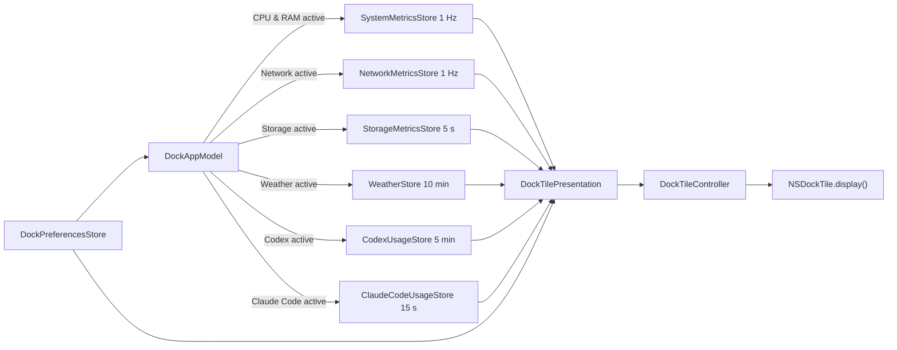

# DockMagic Architecture

## 1. Product contract

DockMagic is a `.regular` macOS application: its Dock icon is both the display
surface and the entry point for opening Settings. There is no `MenuBarExtra`,
`NSStatusItem`, secondary dashboard, or placeholder logo. The app continues
running after Settings closes so the Dock tile can keep updating.

Settings uses a native `NavigationSplitView`:

- `General`: select exactly one active feature.
- `CPU & RAM`: preview, colors, and widths for the two rings.
- `Network`: live preview, current download/upload/interface, and colors for
  the two series.
- `Storage`: live preview, used/available/total capacity, and color/width for
  one ring.
- `Weather`: responsive preview with location name, freshness state, and
  Open-Meteo attribution; there is no connection or Location/privacy section.
- `Codex`: quota preview, display style, colors, and widths for the two rings;
  there are no connection controls.
- `Claude Code`: quota preview, display style, colors, and widths for the two
  rings; there are no connection controls.
- `About`: version, privacy, and distribution.

## 2. Ownership

| Owner | Responsibility |
| --- | --- |
| `DockMagicApp` / `AppDelegate` | Scene graph, activation policy, and app lifecycle |
| `SettingsWindowRouter` | Focuses or opens one Settings window; Dock reopen and `⌘,` share this path |
| `DockAppModel` | Composition root; ensures only the active feature's provider runs |
| `DockPreferencesStore` | Persists the feature, renderer appearance, and Codex executable override |
| `SystemMetricsStore` | `1 Hz` sampling loop, current/history/error state |
| `SystemMetricsSampler` | Reads Mach CPU/VM counters; does not own UI |
| `NetworkMetricsStore` / `NetworkMetricsSampler` | `1 Hz` sampling, up to 60 history samples, and byte-counter deltas for the primary interface |
| `StorageMetricsStore` / `StorageMetricsSampler` | Polls the startup volume every 5 seconds and calculates used/available/total capacity |
| `WeatherStore` | Polls every 10 minutes, caches the snapshot, and owns live/stale/unavailable state |
| `OpenMeteoWeatherProvider` | Obtains Core Location, calls the Forecast API, validates HTTP/JSON, and maps WMO codes |
| `CodexUsageStore` | Polling lifecycle and live/stale/unavailable state |
| `CodexAppServerRateLimitProvider` | Resolves the CLI, communicates with `codex app-server` over JSON-RPC, and parses quotas |
| `ClaudeCodeUsageStore` | Polls the local snapshot and owns freshness and live/stale/unavailable state |
| `ClaudeCodeStatusLineBridge` | Installs/removes the status-line wrapper and preserves the previous configuration |
| `ClaudeCodeStatusLineRateLimitProvider` | Reads and parses only the local `rate_limits` cache |
| `DockTileController` | Maintains one long-lived `NSHostingView`, updates its root view, and calls `NSDockTile.display()` |
| `DockMetricsView` / `DockNetworkView` / `DockStorageView` / `DockWeatherView` / `CodexDockView` | Pure renderers driven by input models and appearance |
| `SettingsView` | Preference UI; does not create timers or call Mach APIs |
| `DesignSystem` / `ProjectTheme` | Tokens, components, semantic palette, and appearance-aware theme root |

Process-lifetime owners are created exactly once in `AppDelegate`. Feature
views do not create local stores, which would cause duplicate timers or polling
and allow the Dock to fall out of sync with Settings.

The design system supports three color schemes—System, Light, and Dark—and
integrates glass by default while limiting it to navigation and chrome under
the Canvas → Content → Navigation architecture. See
[SIGMA_DESIGN_SYSTEM.md](SIGMA_DESIGN_SYSTEM.md) for the distinction between
public Sigma tokens and DockMagic-derived decisions, as well as compatibility
and QA contracts.

## 3. Window lifecycle

`WindowGroup("DockMagic Settings", id: "settings")` is the primary scene macOS
uses to create a window at app launch. `SettingsWindowRouter.showSettings()`
first looks for a window with the corresponding title, brings it forward, and
activates the app. It calls the public `OpenWindowAction` only when no such
window exists.

`applicationShouldHandleReopen` uses the same router and returns `false` because
the delegate has handled the action. `applicationShouldTerminateAfterLastWindowClosed`
also returns `false`. The New Window command is removed, so clicking the Dock,
using `⌘,`, and choosing the Settings menu item do not create competing windows.

## 4. Feature coordination



When the feature changes, the coordinator stops the previous provider before
starting the new one. Both `start()` and `stop()` are idempotent. When the
appearance preference, effective macOS Light/Dark appearance, or accessibility
display options change, the Dock controller re-hosts the current presentation
with the new theme and redraws immediately without waiting for the next sample.

## 5. CPU and RAM

CPU usage is calculated from two `HOST_CPU_LOAD_INFO` samples:

```text
busyDelta = Δuser + Δsystem + Δnice
cpuUsage  = busyDelta / (busyDelta + Δidle)
```

The first sample establishes only the baseline. Counter resets, zero total
deltas, and out-of-range results are handled and clamped to `0...1`.

RAM usage uses `HOST_VM_INFO64`:

```text
usedBytes  = (activePages + wiredPages + compressorPages) × pageSize
memoryUsage = usedBytes / physicalMemory
```

This is an intentional estimate and is not guaranteed to match Activity
Monitor: inactive, speculative, and reclaimable cached pages are not counted as
used. RAM-shortage warnings should be implemented as a separate memory-pressure
feature.

## 6. Network

Network measures only the primary IPv4/IPv6 interface published by
SystemConfiguration instead of summing all interfaces and accidentally
double-counting traffic between a VPN and its physical interface. Counters are
read from the public `NET_RT_IFLIST2` routing sysctl using the 64-bit
`if_msghdr2.ifm_data.ifi_ibytes` and `ifi_obytes` values.

```text
downloadBytesPerSecond = ΔinputBytes / elapsedSeconds
uploadBytesPerSecond   = ΔoutputBytes / elapsedSeconds
```

The first sample establishes only the baseline. An interface change, counter
rollback, invalid elapsed time, or missing interface resets throughput to zero
instead of creating a false spike. `NetworkMetricsStore` samples at `1 Hz`,
runs only while the feature is active, and retains up to 60 samples in memory.
The Dock draws the latest 30 samples; Settings draws 60.

The chart diverges around a central baseline: upload is above and download is
below. Both directions share a linear scale quantized from 64 KiB/s through
1 GiB/s and then to the next power of two. Their heights are therefore directly
comparable, and the scale does not jump on every sample. Network history is not
persisted.

## 7. Storage

Storage reads the startup volume through `URL(fileURLWithPath: "/")`, obtains
`volumeTotalCapacityKey` and `volumeAvailableCapacityForImportantUsageKey`, and
then calculates:

```text
usedBytes = totalBytes - availableBytes
usage     = usedBytes / totalBytes
```

The `available` value matches the way macOS reports space available for
important usage, including space the system can reclaim when needed. If this
API is unavailable, the app falls back to `volumeAvailableCapacityKey`. Values
are normalized and clamped when the file system returns missing or inconsistent
data. `StorageMetricsStore` polls every five seconds only while the feature is
active. Dock and Settings share the same one-ring renderer; the app does not
scan files, require Full Disk Access, or persist capacity snapshots.

## 8. Weather

Weather uses the public macOS Core Location API and the Open-Meteo Forecast API;
it does not scrape Weather.app or require a Shortcut or helper app.

`CoreLocationWeatherCoordinateProvider` requests standard Location permission
and makes a one-shot `requestLocation()` call with three-kilometer accuracy and
a 20-second timeout. One HTTPS request sends the coordinates and requests the
current temperature, apparent temperature, WMO code, daylight state, daily
high/low, and precipitation probability. The provider validates coordinates,
HTTP status, schema, and value ranges before creating `WeatherSnapshot`.

State contract:

- `idle` / `loading`: no usable snapshot exists yet.
- `live`: the Open-Meteo payload is valid and `observedAt` is no more than 45
  minutes old.
- `stale`: the snapshot is old or refresh failed; the latest successful data
  remains rendered with a warning badge.
- `unavailable`: no snapshot exists and Location is disabled, denied, or timed
  out, or the network, HTTP response, or schema is invalid.

Polling runs every 10 minutes only while Weather is the active feature. A manual
refresh remains available in Settings and is deduplicated. The last successful
snapshot is cached in `UserDefaults` under a separate Open-Meteo namespace;
legacy Shortcut cache data is not restored, preventing incorrect attribution.
See [WEATHER_OPEN_METEO.md](WEATHER_OPEN_METEO.md) for authentication, licensing,
setup, and privacy details.

The default build uses the open-access endpoint without an API key and is
suitable only under Open-Meteo's non-commercial terms. The paid commercial
endpoint accepts an `apikey` through provider configuration; a key embedded in
a desktop binary must not be treated as secret. Weather Settings places
`Open-Meteo · CC BY 4.0` directly below the production preview so attribution
remains clear rather than being hidden at the end of setup.

## 9. Codex quota

When Codex is selected in General, the executable is resolved automatically in
this order: a persisted override, if present; the `CODEX_EXECUTABLE` variable;
`PATH`; Homebrew/local candidates; and Node installations under
`~/.nvm/versions/node`. When launching the CLI, the executable's parent
directory is added to `PATH` so the `#!/usr/bin/env node` launcher works.

The provider launches:

```text
codex app-server --stdio
```

It then sends `initialize`, `initialized`, `account/read`, and
`account/rateLimits/read`. Stdin remains open until the rate-limit request
receives a response; the request times out after 12 seconds. The parser
prioritizes the `codex` limit ID, accepts the exact 300-minute and 10,080-minute
windows, clamps `usedPercent`, and converts it to the remaining percentage.

State contract:

- `idle` / `loading`: no usable data exists yet.
- `live`: the current response is valid.
- `stale`: refresh failed, but the latest live snapshot remains available and
  the error is reported.
- `unavailable`: there has never been a snapshot and the CLI or protocol cannot
  be used.

Do not infer a five-hour quota when the server returns only a weekly quota. In
the weekly-only state, the Dock renders one weekly ring in a balanced position.
Polling defaults to every five minutes and begins as soon as Codex is selected;
Settings does not require a manual refresh or executable selection. DockMagic
does not read credential files.

## 10. Claude Code quota

Claude Code provides `/usage` for interactive users, but the Anthropic-documented
automatic integration is `statusLine`. After an assistant response, Claude Code
pipes JSON to the configured command. For a supported subscription, the object
contains:

```text
rate_limits.five_hour.used_percentage
rate_limits.five_hour.resets_at
rate_limits.seven_day.used_percentage
rate_limits.seven_day.resets_at
```

Automatic setup is enabled by default. When Claude Code is selected as the Dock
feature in General, DockMagic installs the bridge at
`~/.claude/dockmagic-statusline.sh`. The bridge uses `plutil` to extract only
`rate_limits`, writes it atomically to `~/.claude/dockmagic-usage.json`, and
passes the original input to the previous status-line command. The backup is
used only to restore the configuration when the bridge is removed. The Claude
Code Settings page contains only the preview and appearance controls, with no
connection controls. The bridge does not read OAuth tokens or Keychain, call
internal web endpoints, or generate model requests.

`rate_limits` may be absent before the first response or for unsupported
accounts. A cache older than 15 minutes renders as `stale`; a missing bridge or
cache, or an invalid schema, becomes `unavailable`. DockMagic does not infer
100% remaining when data is absent. A project-local status line can override
the user-level bridge; the user must then remove the override or configure an
equivalent wrapper in that project.

## 11. Dock rendering

`DockTileController` installs one `NSHostingView` into
`NSApp.dockTile.contentView` and retains that host for the app's lifetime. It
replaces the `rootView` when the presentation changes or the theme/appearance
needs refreshing, then calls `display()` on the main actor.

- The CPU, Codex five-hour, and Claude Code five-hour metrics use the outer
  ring; RAM, Codex weekly, and Claude Code weekly metrics use the inner ring.
  Storage uses one ring. Network uses a diverging chart around a baseline.
  Weather uses a condition symbol and temperature instead of the ring metaphor.
- Dock Network is limited to 30 samples and uses one scale for upload and
  download; zero and unavailable states have distinct symbols to avoid drawing
  a false chart.
- Weather scales with tile sizes from `32...128 pt`; larger tiles add H/L, live
  state adds no badge, stale state adds a clock, and unavailable state adds a
  warning so state is not communicated by color alone.
- Progress uses values in `0...1`; tracks use semantic assets.
- Colors and strokes are product-owned preferences with feature-specific
  defaults.
- Stroke widths are clamped individually and in aggregate so the two rings do
  not overlap.
- The Dock path does not run interpolation animations because the Dock
  compositor captures frames only when `display()` is called.
- Accessibility labels and values always communicate the feature, value, and
  state; color is not the only signal.

The Settings preview uses the same production renderer but allows short
animations to provide immediate interaction feedback.

## 12. Persistence and privacy

`UserDefaults` stores only:

- the System/Light/Dark appearance color scheme; glass chrome is the default in
  all three;
- the active feature;
- RGBA values, stroke widths, and Chart/Numbers display styles for CPU/RAM,
  Storage, Codex, and Claude Code;
- RGBA values for the Network download and upload series;
- the last successful Weather snapshot;
- the Codex executable override, if present.

Real-time metric samples, Network history, tokens, prompts, and account metadata
are not persisted in the app container. CPU/RAM, Network, and Storage data do
not leave the Mac. The Weather cache contains only data already shown to the
user (location label, temperature, condition, and freshness); current
coordinates are sent to Open-Meteo over HTTPS and are not stored as location
history. The Codex app-server uses the login session owned by the Codex CLI.
The Claude Code bridge persists a minimal usage snapshot because the status
line delivers data only in response to events; the file contains only the two
`rate_limits` windows and is deleted when the bridge is removed.

## 13. Threading and failure containment

Stores, the app model, and the AppKit bridge are `@MainActor`. Mach, network,
and file-system reads and process I/O are encapsulated behind protocols so they
can be tested with doubles. Polling and sampling tasks are cancellable; sleeping
tasks do not retain stores indefinitely. A failure does not create a busy retry
loop.

Provider or process failures must become descriptive UI states. They must not
crash the app or leave another feature running in the background.

## 14. Verification contract

Every change must be checked according to its risk:

1. Unit: clamping/persistence, Network delta/reset/scale, Storage capacity math,
   Weather/Open-Meteo requests/decoder/WMO variants, executable resolution,
   timeout/cancellation, live→stale/unavailable transitions, lifecycle
   exclusivity, Mach math, and Dock redraw.
2. Renderer: Weather at `32/48/64/128 pt`; Network and Storage; and CPU, Codex,
   and Claude Code in loading/live/weekly-only/stale/error states, including
   Chart and Numbers at multiple tile sizes.
3. UI: launch Settings with glass chrome, three appearance options, eight
   sidebar destinations, active-feature icon/picker, numeric display controls,
   and close→Dock activation→one Settings window.
4. Runtime: signed launch smoke test; process remains alive after Settings
   closes.
5. Release: Developer ID, Hardened Runtime, notarization, Gatekeeper, and real
   Dock-pixel observation at multiple sizes and positions.

The AX tree and offscreen renders prove wiring and layout; they do not replace
observing pixels produced by the system Dock compositor or manually testing
VoiceOver before release. An XCUI runner on macOS requires a valid Apple
Development signing identity. If AppleSystemPolicy kills an unsigned runner
before test bootstrap, that must not be reported as a product-test failure.
