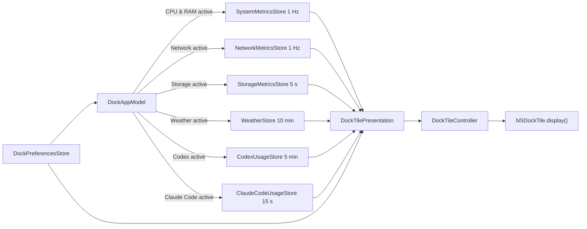

# Kiến trúc DockMagic

## 1. Product contract

DockMagic là ứng dụng macOS `.regular`: icon Dock vừa là mặt hiển thị vừa là
entry point mở Settings. Không có `MenuBarExtra`, `NSStatusItem`, dashboard phụ
hay logo placeholder. App tiếp tục chạy khi Settings đóng để Dock tile được cập
nhật.

Settings có native `NavigationSplitView`:

- `General`: chọn đúng một feature active.
- `CPU & RAM`: preview, màu và độ rộng hai vòng.
- `Network`: preview live, current download/upload/interface, chart 60 giây và
  màu hai series.
- `Storage`: preview live, used/available/total và màu/độ rộng một vòng.
- `Weather`: preview responsive, trạng thái freshness, Open-Meteo attribution
  và hướng dẫn Location/privacy.
- `Codex`: preview quota, trạng thái CLI, refresh, màu và độ rộng hai vòng.
- `Claude Code`: preview quota, status line bridge, refresh, màu và độ rộng hai
  vòng.
- `About`: version, privacy và distribution.

## 2. Ownership

| Owner | Trách nhiệm |
| --- | --- |
| `DockMagicApp` / `AppDelegate` | Scene graph, activation policy, app lifecycle |
| `SettingsWindowRouter` | Focus hoặc mở một Settings window; Dock reopen và `⌘,` dùng chung đường này |
| `DockAppModel` | Composition root và đảm bảo chỉ provider của feature active chạy |
| `DockPreferencesStore` | Persist feature, renderer appearance và Codex executable override |
| `SystemMetricsStore` | Sampling loop `1 Hz`, current/history/error |
| `SystemMetricsSampler` | Đọc Mach CPU/VM counters, không sở hữu UI |
| `NetworkMetricsStore` / `NetworkMetricsSampler` | Sampling `1 Hz`, history tối đa 60 mẫu và delta byte counters của primary interface |
| `StorageMetricsStore` / `StorageMetricsSampler` | Poll startup volume mỗi 5 giây và tính used/available/total |
| `WeatherStore` | Poll 10 phút, cache snapshot và state live/stale/unavailable |
| `OpenMeteoWeatherProvider` | Lấy Core Location, gọi Forecast API, validate HTTP/JSON và map WMO code |
| `CodexUsageStore` | Polling lifecycle và state live/stale/unavailable |
| `CodexAppServerRateLimitProvider` | Resolve CLI, nói JSON-RPC với `codex app-server` và parse quota |
| `ClaudeCodeUsageStore` | Poll local snapshot, freshness và state live/stale/unavailable |
| `ClaudeCodeStatusLineBridge` | Cài/gỡ wrapper status line và bảo toàn config cũ |
| `ClaudeCodeStatusLineRateLimitProvider` | Chỉ đọc/parse cache `rate_limits` local |
| `DockTileController` | Một `NSHostingView` lâu dài, cập nhật root view và gọi `NSDockTile.display()` |
| `DockMetricsView` / `DockNetworkView` / `DockStorageView` / `DockWeatherView` / `CodexDockView` | Renderer thuần từ input model và appearance |
| `SettingsView` | UI preferences; không tạo timer hay gọi Mach API |
| `DesignSystem` / `ProjectTheme` | Tokens, components, semantic palette và Light root |

Các owner sống suốt process được tạo đúng một lần trong `AppDelegate`. Feature
view không tạo store cục bộ, vì việc đó sẽ gây timer/polling trùng và Dock không
đồng bộ với Settings.

## 3. Lifecycle cửa sổ

`WindowGroup("DockMagic Settings", id: "settings")` là primary scene để macOS
tạo cửa sổ khi app launch. `SettingsWindowRouter.showSettings()` luôn tìm cửa
sổ có title tương ứng trước, đưa nó lên trước và activate app; chỉ gọi public
`OpenWindowAction` khi chưa có cửa sổ.

`applicationShouldHandleReopen` đi qua cùng router và trả `false` vì delegate
đã xử lý action. `applicationShouldTerminateAfterLastWindowClosed` trả `false`.
New Window command bị loại bỏ, nên click Dock, `⌘,` và menu Settings không sinh
thêm cửa sổ cạnh tranh.

## 4. Feature coordination



Khi đổi feature, coordinator dừng provider cũ trước khi start provider mới.
`start()`/`stop()` đều idempotent. Preference thay đổi appearance tạo một
presentation mới và Dock controller redraw ngay, không cần đợi sample tiếp theo.

## 5. CPU và RAM

CPU dùng hai mẫu `HOST_CPU_LOAD_INFO`:

```text
busyDelta = Δuser + Δsystem + Δnice
cpuUsage  = busyDelta / (busyDelta + Δidle)
```

Mẫu đầu chỉ tạo baseline. Counter reset, tổng delta bằng 0 và kết quả ngoài
range đều được xử lý/clamp về `0...1`.

RAM dùng `HOST_VM_INFO64`:

```text
usedBytes  = (activePages + wiredPages + compressorPages) × pageSize
memoryUsage = usedBytes / physicalMemory
```

Đây là ước lượng có chủ đích, không cam kết trùng Activity Monitor: inactive,
speculative và cache có thể thu hồi không được coi là used. Nếu cần cảnh báo
thiếu RAM nên thêm memory-pressure feature riêng.

## 6. Network

Network chỉ đo primary IPv4/IPv6 interface do SystemConfiguration công bố,
thay vì cộng tất cả interface và vô tình đếm đôi traffic giữa VPN và interface
vật lý. Counter được đọc từ public routing sysctl `NET_RT_IFLIST2` với
`if_msghdr2.ifm_data.ifi_ibytes` và `ifi_obytes` 64-bit.

```text
downloadBytesPerSecond = ΔinputBytes / elapsedSeconds
uploadBytesPerSecond   = ΔoutputBytes / elapsedSeconds
```

Mẫu đầu chỉ tạo baseline. Đổi interface, counter rollback, elapsed time không
hợp lệ hoặc thiếu interface đều reset tốc độ về 0 thay vì tạo spike giả.
`NetworkMetricsStore` lấy mẫu `1 Hz`, chỉ sống khi feature active và giữ tối đa
60 mẫu trong bộ nhớ. Dock vẽ 30 mẫu gần nhất; Settings vẽ 60 mẫu.

Chart diverge quanh baseline giữa: upload ở trên, download ở dưới. Hai hướng
dùng chung thang tuyến tính được quantize theo các mức 64 KiB/s tới 1 GiB/s rồi
lên power-of-two tiếp theo, nên độ cao hai phía có thể so sánh trực tiếp và
không nhảy scale ở từng sample. Không có network history nào được persist.

## 7. Storage

Storage đọc startup volume qua `URL(fileURLWithPath: "/")`, lấy
`volumeTotalCapacityKey` và `volumeAvailableCapacityForImportantUsageKey` rồi tính:

```text
usedBytes = totalBytes - availableBytes
usage     = usedBytes / totalBytes
```

Giá trị `available` khớp cách macOS báo dung lượng có thể dùng cho tác vụ quan
trọng, bao gồm cả phần hệ thống có thể thu hồi khi cần. Nếu API này không khả
dụng, app fallback về `volumeAvailableCapacityKey`. Giá trị được
normalize/clamp khi filesystem trả dữ liệu thiếu hoặc lệch.
`StorageMetricsStore` poll mỗi 5 giây chỉ khi feature active. Dock và Settings
dùng cùng renderer một vòng; không quét file, không cần Full Disk Access và
không persist capacity snapshot.

## 8. Weather

Weather dùng Core Location public của macOS và Open-Meteo Forecast API, không
scrape Weather.app hoặc yêu cầu Shortcut/helper app:

`CoreLocationWeatherCoordinateProvider` xin quyền Location chuẩn, dùng one-shot
`requestLocation()` ở accuracy ba kilomet và timeout 20 giây. Tọa độ được truyền
qua HTTPS với current temperature/apparent temperature/WMO code/daylight và daily
high/low/precipitation probability trong một request. Provider validate tọa độ,
HTTP status, schema và range trước khi tạo `WeatherSnapshot`.

State contract:

- `idle` / `loading`: chưa có snapshot dùng được.
- `live`: Open-Meteo payload hợp lệ và `observedAt` không quá 45 phút.
- `stale`: snapshot cũ hoặc refresh lỗi; vẫn render dữ liệu thành công gần nhất
  cùng badge cảnh báo.
- `unavailable`: chưa có snapshot và Location bị tắt/từ chối/timeout, network,
  HTTP hoặc schema không hợp lệ.

Chỉ feature Weather active mới poll mỗi 10 phút. Refresh thủ công vẫn chạy từ
Settings và được deduplicate. Snapshot thành công cuối cùng được cache trong
`UserDefaults` bằng namespace Open-Meteo riêng; cache Shortcut legacy không được
restore để tránh attribution sai. Xem [WEATHER_OPEN_METEO.md](WEATHER_OPEN_METEO.md) cho auth,
licence, setup và privacy.

Build mặc định dùng open-access endpoint không API key, chỉ phù hợp với
non-commercial terms của Open-Meteo. Paid commercial endpoint nhận `apikey` qua
provider configuration; không coi key nhúng trong desktop binary là secret.
Weather Settings đặt `Open-Meteo · CC BY 4.0` ngay dưới production preview để
attribution luôn rõ, không ẩn ở cuối setup.

## 9. Codex quota

Executable resolution theo thứ tự: path người dùng chọn, biến
`CODEX_EXECUTABLE`, `PATH`, Homebrew/local candidates và các bản Node trong
`~/.nvm/versions/node`. Khi chạy CLI, parent directory của executable được thêm
vào `PATH` để launcher `#!/usr/bin/env node` hoạt động.

Provider khởi chạy:

```text
codex app-server --stdio
```

Sau đó gửi `initialize`, `initialized`, `account/read` và
`account/rateLimits/read`. Stdin được giữ mở cho tới khi nhận response của
request rate limit; request bị timeout sau 12 giây. Parser ưu tiên limit id
`codex`, nhận chính xác cửa sổ 300 phút và 10.080 phút, clamp `usedPercent`, rồi
chuyển thành phần trăm còn lại.

State contract:

- `idle` / `loading`: chưa có dữ liệu sử dụng được.
- `live`: response hiện tại hợp lệ.
- `stale`: refresh lỗi nhưng vẫn giữ snapshot live gần nhất và nêu lỗi.
- `unavailable`: chưa từng có snapshot và CLI/protocol không dùng được.

Không suy diễn quota 5 giờ khi server chỉ trả quota tuần. Với weekly-only, Dock
render một vòng tuần ở vị trí cân bằng. Polling mặc định 5 phút, hoặc refresh
thủ công trong Settings. DockMagic không đọc credential files.

## 10. Claude Code quota

Claude Code có `/usage` cho người dùng tương tác, nhưng integration tự động được
tài liệu Anthropic hỗ trợ là `statusLine`. Sau assistant response, Claude Code
pipe JSON vào command đã cấu hình. Với subscription được hỗ trợ, object này có:

```text
rate_limits.five_hour.used_percentage
rate_limits.five_hour.resets_at
rate_limits.seven_day.used_percentage
rate_limits.seven_day.resets_at
```

Settings chỉ cài bridge khi người dùng bấm Enable. Bridge ở
`~/.claude/dockmagic-statusline.sh` dùng `plutil` lấy riêng `rate_limits`, ghi
atomic vào `~/.claude/dockmagic-usage.json`, rồi chuyển nguyên input cho command
status line cũ. Backup chỉ dùng để restore cấu hình khi Disable. Bridge không
đọc OAuth token/Keychain, không gọi endpoint web nội bộ và không làm phát sinh
model request.

`rate_limits` có thể vắng trước response đầu tiên hoặc với account không được
hỗ trợ. Cache quá 15 phút được render `stale`; thiếu bridge/cache hoặc schema
không hợp lệ trở thành `unavailable`. Không suy đoán 100% còn lại khi dữ liệu
vắng. Project-local status line có thể override user-level bridge; khi đó người
dùng cần bỏ override hoặc cấu hình wrapper tương đương ở project đó.

## 11. Dock rendering

`DockTileController` cài một `NSHostingView` vào `NSApp.dockTile.contentView` và
giữ host đó suốt vòng đời app. Nó chỉ thay `rootView` khi presentation thực sự
đổi rồi gọi `display()` trên main actor.

- CPU/Codex/Claude Code 5 giờ là vòng ngoài; RAM/Codex/Claude Code tuần là vòng
  trong. Storage dùng một vòng. Network dùng diverging chart quanh baseline;
  Weather dùng condition symbol + temperature, không dùng ring metaphor.
- Dock Network giới hạn 30 mẫu và dùng chung scale cho upload/download; zero và
  unavailable có symbol riêng để không tạo chart giả.
- Weather scale theo tile `32...128 pt`; tile lớn thêm H/L, live không thêm
  badge, stale có clock và unavailable có cảnh báo để trạng thái không chỉ dựa
  vào màu.
- Progress dùng giá trị `0...1`; track dùng semantic asset.
- Màu/stroke là preference product-owned với default riêng từng feature.
- Stroke được clamp riêng và clamp tổng để hai vòng không chồng nhau.
- Dock path không chạy interpolation animation vì Dock compositor chỉ chụp các
  frame khi `display()` được gọi.
- Accessibility label/value luôn diễn đạt feature, giá trị và trạng thái; màu
  không phải tín hiệu duy nhất.

Settings preview dùng cùng production renderer, nhưng cho phép animation ngắn
để phản hồi thao tác trực tiếp.

## 12. Persistence và privacy

`UserDefaults` chỉ lưu:

- feature active;
- RGBA + stroke width cho CPU/RAM, Storage, Codex và Claude Code;
- RGBA cho hai series download/upload của Network;
- snapshot Weather thành công cuối cùng;
- Codex executable override (nếu có).

Realtime metric samples, Network history, token, prompt và account metadata
không được persist trong app container. CPU/RAM, Network và Storage không ra
khỏi máy. Weather cache chỉ chứa dữ liệu đã hiển thị
(location label, nhiệt độ, condition, freshness); tọa độ hiện tại được gửi qua
HTTPS tới Open-Meteo và không được lưu thành location history. Codex app-server dùng chính phiên đăng
nhập do Codex CLI sở hữu. Claude Code bridge
persist snapshot usage tối thiểu vì status line chỉ giao dữ liệu theo event;
file chỉ chứa hai cửa sổ `rate_limits` và được xóa khi Disable.

## 13. Threading và failure containment

Stores, app model và AppKit bridge là `@MainActor`. Mach, network, filesystem
reads và process I/O được đóng gói sau protocol để test bằng double.
Poll/sampling task có thể cancel; task ngủ không giữ store sống vô hạn. Một lỗi
không tạo busy retry loop.

Provider/process failure phải trở thành UI state có mô tả, không crash app hoặc
giữ feature còn lại chạy ngầm.

## 14. Verification contract

Mỗi thay đổi cần kiểm tra theo mức rủi ro:

1. Unit: clamp/persistence, Network delta/reset/scale, Storage capacity math,
   Weather/Open-Meteo request/decoder/WMO variants, executable resolution, timeout/cancel,
   live→stale/unavailable, lifecycle exclusivity, Mach math và Dock redraw.
2. Renderer: Weather `32/48/64/128 pt`, Network/Storage và
   CPU/Codex/Claude Code loading/live/weekly-only/stale/error ở nhiều tile size.
3. UI: launch Settings Light, tám sidebar destinations, picker exclusivity,
   Network/Storage destination, close→Dock activation→một Settings window.
4. Runtime: signed launch smoke, process sống sau khi đóng Settings.
5. Release: Developer ID, Hardened Runtime, notarization, Gatekeeper và quan sát
   pixel thật trên Dock ở nhiều size/position.

AX tree và offscreen render chứng minh wiring/layout, không thay thế việc quan
sát pixel do system Dock compositor tạo ra hoặc VoiceOver thủ công trước release.
XCUI runner trên macOS cần Apple Development signing identity hợp lệ; một
unsigned runner bị AppleSystemPolicy kill trước khi test bootstrap và không được
báo cáo như một product-test failure.
