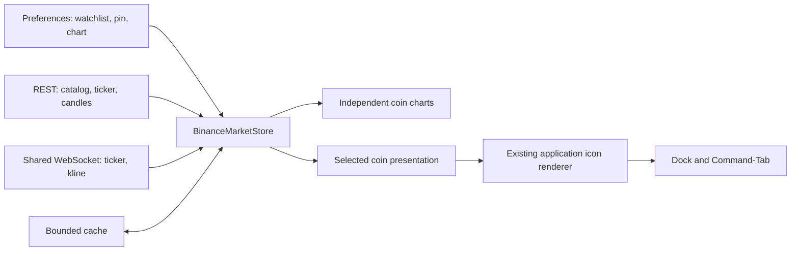

# Nghiên cứu tích hợp Binance vào DockMagic

Ngày kiểm tra: **16/09/2026**. Trạng thái: **đề xuất trước triển khai**.

## Kết luận

Yêu cầu khả thi về kỹ thuật với **Binance Spot Market Data**: tìm và thêm cặp giao dịch, mỗi cặp có chart riêng, cấu hình chart trong Settings, và hiển thị giá cặp được pin hoặc cặp đầu tiên trên Dock. REST và WebSocket công khai đã được thử trực tiếp, bao gồm một chương trình Swift 5.10 dùng Foundation của macOS.

Đề xuất: REST để lấy danh mục và lịch sử; một WebSocket dùng chung để cập nhật ticker và nến; Swift Charts để dựng biểu đồ native. Các quyết định UI và lifecycle dưới đây là đề xuất, chưa phải tính năng đã chạy trong DockMagic.

Quyền hiển thị dữ liệu cho người dùng của sản phẩm thương mại **chưa được xác nhận**. Repo dẫn sang Terms of Use; mục 27 của bản điều khoản đang được website cung cấp giới hạn giấy phép Binance IP vào sử dụng cá nhân phi thương mại hoặc nội bộ doanh nghiệp. Chưa có bằng chứng đủ để kết luận giấy phép đó cho phép phân phối dashboard trong DockMagic. Cần làm rõ phạm vi áp dụng với Binance trước phát hành thương mại; nghiên cứu này không kết luận rằng tích hợp bị cấm. [Điều khoản, hiệu lực 21/07/2026, mục 27](https://bin.bnbstatic.com/static/cms/cg08ou2ak0tn7mcplvfg/file/bf4879710c904b991848972ec4818ba2cf9e4ce314c09adae84fa2750d3477f7.pdf#page=46).

## Nguồn chính thức và phạm vi dữ liệu

Đã đọc repository [binance/binance-spot-api-docs](https://github.com/binance/binance-spot-api-docs), với HEAD tại thời điểm kiểm tra là [`b8a0f61e088c65d18a157f2e11a8e273826b6c08`](https://github.com/binance/binance-spot-api-docs/tree/b8a0f61e088c65d18a157f2e11a8e273826b6c08), commit ngày 09/09/2026. Đây là **repository tài liệu giao thức**, không phải thư viện chart hay Swift SDK.

| Nhu cầu | API/stream lựa chọn | Ý nghĩa |
| --- | --- | --- |
| Danh mục để tìm kiếm | `GET /api/v3/exchangeInfo` | Lấy symbol, base/quote, trạng thái và precision/filter |
| Dữ liệu lịch sử chart | `GET /api/v3/klines` | Nến OHLCV; dùng close cho đường giá |
| Snapshot giá/biến động | `GET /api/v3/ticker/24hr?symbols=…` | Lấy nhiều cặp trong một request |
| Giá và biến động liên tục | `<symbol>@ticker` | Last price và thống kê 24 giờ trượt |
| Nến đang hình thành | `<symbol>@kline_<interval>` | Cập nhật nến, có cờ đóng nến `x` |

REST host: `https://data-api.binance.vision`. WebSocket host: `wss://data-stream.binance.vision:443`. Hai host này phục vụ dữ liệu thị trường công khai, không cần key. [Market Data Only](https://github.com/binance/binance-spot-api-docs/blob/b8a0f61e088c65d18a157f2e11a8e273826b6c08/faqs/market_data_only.md).

`klines` trả tối đa 1.000 nến/request, weight 2. `exchangeInfo` weight 20; ticker batch 1–20 symbol weight 2. Chọn `klines` làm nguồn thống nhất với stream; `uiKlines` được tài liệu mô tả là dữ liệu đã chỉnh cho trình bày, nên không mặc định coi hai nguồn tương đương. [REST API](https://github.com/binance/binance-spot-api-docs/blob/b8a0f61e088c65d18a157f2e11a8e273826b6c08/rest-api.md).

Phân loại phạm vi cho feature:

| Trường hoặc hành vi | Đánh giá |
| --- | --- |
| Last traded price, OHLCV, high/low và biến động 24h | Được hỗ trợ cho cặp Spot của Binance |
| Giá BTC/USDT | Giá bằng USDT; không tự đổi nhãn thành USD |
| Khối lượng | Theo cặp trên Binance; phân biệt base volume và quote volume |
| Giá tổng hợp toàn thị trường, market cap, circulating supply | Không có trong các endpoint đã chọn |
| Tên đầy đủ và logo từng coin | Catalog đã kiểm tra chỉ đủ symbol/base/quote; không xác nhận nguồn metadata này |
| Futures, funding, vị thế, P&L, ví và đặt lệnh | Ngoài phạm vi feature theo dõi chart Spot |

Định danh lưu trữ phải là **cặp giao dịch**. `BTCUSDT` và `BTCUSDC` là hai mục khác nhau. UI có thể gọi là “coin” nhưng luôn trình bày base/quote để người dùng biết chính xác đang xem gì. Tìm kiếm ban đầu hỗ trợ `BTC`, `ETH`, `BTCUSDT`, `BTC/USDT`; không hứa tìm tên “Bitcoin” cho mọi asset khi chưa có nguồn tên đầy đủ.

## Kiểm chứng thực tế

Evidence và chương trình tái lập nằm trong [research/binance-2026-09-16](research/binance-2026-09-16/README.md).

| Kiểm tra | Kết quả quan sát |
| --- | --- |
| Catalog `permissions=SPOT`, `symbolStatus=TRADING` | HTTP 200; 1.370 cặp, trong đó 491 cặp USDT tại thời điểm kiểm tra |
| Ticker BTCUSDT, ETHUSDT, SOLUSDT | HTTP 200; đúng 3 symbol và các trường giá/thống kê |
| BTCUSDT, nến 1 phút | HTTP 200; 61 nến |
| ETHUSDT, nến 5 phút | HTTP 200; 289 nến |
| SOLUSDT, nến 1 giờ | HTTP 200; 169 nến |
| Thứ tự và OHLC của ba chuỗi trên | Open time tăng, không trùng; high/low bao quanh open/close |
| Symbol không hợp lệ | HTTP 400, `code=-1121`, `msg="Invalid symbol."` |
| Swift `URLSessionWebSocketTask`, combined stream | Chạy 39,41 giây; nhận ticker BTC 39, ETH 37; nến BTC 19, ETH 18; không có lỗi |

Các con số catalog là snapshot, không phải danh sách cố định. Phản hồi `exchangeInfo` lúc thử công bố `REQUEST_WEIGHT=6000/phút`; production đọc metadata và headers thay vì hard-code đây là cam kết lâu dài.

Probe WebSocket xác nhận bốn stream dùng được qua Foundation hiện tại. Nó chưa chứng minh reconnect sau 24 giờ, sleep/wake, mạng chập chờn, toàn bộ khu vực địa lý, hay hiệu năng nhiều chart trong app. Không có giao dịch hay tài khoản nào được sử dụng. Chưa build hoặc chạy giao diện Binance trong DockMagic.

## Đề xuất dashboard và Settings

### Dashboard

- Giữ phần đầu cố định: nhận diện Binance, ô tìm kiếm, nút **Add coin**, nút mở Settings.
- Tìm kiếm có hai nhóm rõ ràng: mục đã theo dõi và kết quả có thể thêm; mục đã có hiển thị “Added”, không thêm trùng cùng symbol.
- Mỗi card gồm cặp giao dịch, giá hiện tại, biến động có nhãn **24h**, nút **Pin to Dock**, chart, trạng thái dữ liệu và menu xóa/di chuyển.
- Watchlist cuộn dọc bằng `LazyVStack`. Thứ tự người dùng lưu là thứ tự chuẩn; tìm kiếm chỉ thay phần đang nhìn thấy.
- Đề xuất panel khoảng 620 × 640 pt, điều chỉnh theo vùng màn hình; card cao khoảng 190–220 pt. Đây là kích thước khởi điểm cần visual QA, không áp dụng kích thước cứng khi màn hình nhỏ.
- Chart và trục giá của mỗi cặp độc lập; không chồng nhiều coin vào một plot.
- Lần đầu danh sách trống: “Add your first coin” và gợi ý BTC/USDT, ETH/USDT, SOL/USDT nếu các cặp đang có trong catalog.
- Hover chart hiển thị tooltip bên trong card: thời gian, OHLC hoặc close, volume nếu bật; không chỉ dựa vào `.help` của macOS.

### Settings → Binance

| Cấu hình đề xuất | Mặc định | Phạm vi tác động |
| --- | --- | --- |
| Chart type | Line | Chuyển đồng bộ mọi card giữa Line và Candlestick |
| Time range | 24H | Áp dụng cùng khoảng xem cho các chart |
| Show volume | Tắt | Thêm vùng volume thấp dưới mỗi chart |
| Preferred quote asset | USDT | Ưu tiên kết quả khi thêm coin; không đổi các cặp đã lưu |
| Dock price format | Adaptive | Giữ giá đọc được theo kích thước Dock |
| Preview | Renderer production | Phản ánh coin thực sự sẽ xuất hiện trên Dock |

MVP dùng cấu hình chart chung để các card dễ so sánh và giảm số điều khiển. Nếu thêm bộ chọn khoảng xem ở dashboard, nó cập nhật cùng một configuration với Settings; không có hai giá trị xung đột. Cấu hình độc lập từng coin chỉ nên bổ sung nếu có nhu cầu rõ ràng.

Khoảng xem và độ dài mỗi nến là hai khái niệm khác nhau. Đề xuất ánh xạ:

| Khoảng xem | Interval | Số nến mục tiêu tối đa, gồm biên và nến đang chạy |
| --- | --- | --- |
| 1H | `1m` | 61 |
| 24H | `5m` | 289 |
| 7D | `1h` | 169 |
| 30D | `4h` | 181 |
| 1Y, quy ước 365 ngày | `1d` | 366 |

Truy vấn và ghép nến theo UTC. Nhãn trục/tooltip có thể theo giờ máy nhưng phải ghi múi giờ khi hiển thị chi tiết. Coin mới niêm yết có thể không đủ lịch sử; biểu diễn phần dữ liệu hiện có, không dựng đoạn giả. Con số thay đổi **24h** vẫn lấy ticker 24h, kể cả khi chart đang ở 7D; nếu cần thay đổi trong khoảng xem thì phải có nhãn và phép tính riêng.

### Pin và giá trên Dock

Giữ watchlist có thứ tự và `pinnedSymbol: String?`, tối đa một pin:

```text
dockSymbol = pinnedSymbol thuộc watchlist ? pinnedSymbol : watchlist.first
```

- Pin card B: Dock chuyển sang B; thứ tự card giữ nguyên.
- Bỏ pin: Dock quay lại coin đầu tiên trong thứ tự đã lưu.
- Thêm coin: thêm cuối; không đổi coin trên Dock khi đã có mục đầu hoặc pin.
- Xóa coin đang pin: xóa pin cùng transaction rồi dùng mục đầu còn lại.
- Search/filter không thay đổi `dockSymbol`.
- Coin được chọn tạm mất dữ liệu: giữ đúng coin với giá last-known và dấu stale, hoặc `—` nếu chưa từng có giá; không âm thầm đổi sang coin khác.
- Cặp ngừng giao dịch vẫn được giữ trong watchlist với trạng thái unavailable cho tới khi người dùng đổi/xóa. Catalog lỗi mạng không được diễn giải thành delisting.
- Watchlist trống: biểu tượng feature và `—`, không hiện giá 0.

Dock đề xuất hiển thị ticker, giá lớn, đơn vị quote; thông tin phụ chỉ xuất hiện khi còn chỗ. Format giá dùng Decimal, bỏ zero dư, thích ứng với giá rất nhỏ; không cố định hai chữ số khiến token nhỏ thành 0.00. Dùng metadata precision/filter làm tham chiếu, giữ giá chính xác trong dashboard. Không mặc định gắn `$` cho USDT.

## Kỹ thuật cần thay đổi trong DockMagic

### Tái sử dụng kiến trúc hiện có

| Vị trí hiện tại | Phần sẽ mở rộng |
| --- | --- |
| `DockMagic/DockMagic/Models/DockConfiguration.swift:4` | Thêm `.binance`, metadata feature và `hasHoverDashboard` |
| Cùng file, `DockTilePresentation:586` | Thêm presentation chỉ chứa dữ liệu cần để vẽ Dock |
| `DockMagic/DockMagic/Stores/DockPreferencesStore.swift:6` | Persist configuration/watchlist/pin có version và normalize |
| `DockMagic/DockMagic/Stores/DockAppModel.swift:6` | Inject store; theo dõi preference; start/stop và recovery |
| `DockMagic/DockMagic/Views/Settings/SettingsView.swift:4` | Destination, sidebar, feature picker, detail và preview Binance |
| `DockMagic/DockMagic/App/DockMagicApp.swift:413` | Dock feature menu và route mở dashboard |
| `DockMagic/DockMagic/Views/Hover/CodexHoverDashboardView.swift:18` | Thêm nhánh Binance trong `DockHoverDashboardRoot`; tái dùng chrome |
| `DockMagic/DockMagic/Services/DockHoverCoordinator.swift:670` | Panel size, lifecycle hiển thị và cơ chế nhập liệu |
| `DockMagic/DockMagic/Views/Dock/DockMetricsView.swift:3` | Thêm nhánh `DockBinanceView` trong `DockTileView` |

**Renderer hiện tại đã được xác minh lại từ source:** `DockTileController` gán `applicationIconImage` từ `DockApplicationIconRenderer` rồi gọi `dockTile.display()`; `dockTile.contentView = nil`. Renderer tạo nguồn ảnh độ phân giải cao dùng chung cho Dock và Command-Tab. Vì vậy Binance phải đi qua pipeline này. Không dựng controller hoặc hosting view riêng để cập nhật giá.

Repo hiện đã dùng Swift Charts ở `SystemMetricsHoverDashboardView.swift` và `NetworkHistoryChart.swift`. Đề xuất Line dùng `LineMark`; Candlestick ghép `RectangleMark` với `RuleMark`; volume dùng `BarMark`. Đây là lựa chọn triển khai cần render/profiling thực tế, không khẳng định framework có sẵn một candlestick widget hoàn chỉnh. [Apple Charts](https://developer.apple.com/documentation/charts/chart).

Các thành phần mới dự kiến:

```text
BinanceMarketModels.swift        symbol, ticker, candle, typed state
BinanceConfiguration.swift      ordered watchlist, pin, chart settings
BinanceMarketDataClient.swift    REST + typed provider errors
BinanceMarketStreamClient.swift  combined WS + subscriptions/reconnect
BinanceMarketCache.swift         bounded cache keyed by symbol/interval
BinanceMarketStore.swift         one source of observable market state
BinanceSettingsView.swift       shared Settings components
BinanceDashboardView.swift      header, finder, ordered coin cards
BinancePriceChartView.swift      native price/volume renderer
DockBinanceView.swift           compact selected-coin price
```

Binance là feature thị trường, nên không gắn nó vào manifest AI provider, quota, usage, streak hoặc activity-share. Áp dụng `COLOR_DESIGN_SYSTEM.md` và `DESIGN_SYSTEM.md`; không suy ra Binance cần các module của dashboard AI.

### Search trong panel hover

`DockHoverPanel` hiện có `canBecomeKey = false`, đồng thời `scheduleHide()` theo vị trí chuột. Thêm `TextField` đơn thuần chưa giải quyết việc gõ, chọn kết quả và giữ panel mở.

Đề xuất host có **chế độ tương tác bật theo hành động người dùng**, áp dụng cho dashboard Binance:

1. Khi chỉ hover, panel mở ở chế độ xem và không lấy focus bàn phím.
2. Click Search/Add chuyển sang chế độ nhập: cho panel nhận key, focus ô tìm kiếm và giữ panel trong thời gian tương tác.
3. Enter thêm/chọn kết quả; Escape đóng kết quả rồi trả về chế độ xem; click ngoài đóng panel và trả focus phù hợp.
4. Không để sự kiện hover lặp lại dựng lại root làm mất text/caret. Menu/popover được tính vào thời gian tương tác.
5. Hành vi này cần test AppKit thật, gồm bộ gõ tiếng Việt và chuyển ứng dụng; không được coi là đã xác minh chỉ bằng source.

Ngoài hover, cần nút **Open dashboard** tại Settings và mục menu Dock để mở cùng nội dung ở host nhận bàn phím. Hover hiện phụ thuộc cài đặt/quyền Accessibility; API Binance và khả năng dùng dashboard không nên phụ thuộc việc người dùng bật hover.

### Luồng dữ liệu và tài nguyên



- Parse/network làm ngoài main actor; store publish snapshot đã coalesce cho SwiftUI.
- Mở dashboard: lấy catalog cache trước, refresh theo TTL; lấy ticker batch và lịch sử các card. Subscribe stream trước hoặc đồng thời và buffer event trong lúc snapshot tải.
- Ghép nến theo `(symbol, interval, openTime)`: cập nhật cùng bucket, thêm bucket mới, giữ closed candle không bị event cũ mở lại. Có generation token cho mỗi lần đổi range/coin để response cũ không ghi đè view mới.
- REST và WS có thể đến khác thứ tự. Khi đồng bộ lại, buffer stream, nạp phần lịch sử chồng biên, áp dụng các event mới hơn; không thay toàn bộ state bằng response tới muộn.
- Một kết nối chứa nhiều stream; dùng `SUBSCRIBE`/`UNSUBSCRIBE` theo nhu cầu. Không tạo một socket riêng cho mỗi card và không đăng ký toàn bộ thị trường.
- Dashboard mở: ticker cho watchlist giới hạn; kline cho card trong viewport và vùng prefetch. Card ở xa lấy lại snapshot khi xuất hiện. Đề xuất giới hạn ban đầu 20 cặp, có thông báo rõ khi đạt giới hạn.
- Dashboard đóng nhưng Binance đang active: giữ ticker của đúng coin trên Dock, dừng stream nến; lần mở lại backfill phần thiếu.
- Feature không active và dashboard/preview không mở: dừng networking Binance. Settings chỉ mở cấu hình thì dùng cache; preview cần giá mới có demand riêng.
- Pin thay đổi: đổi subscription coin Dock; card khác cập nhật không được làm icon render lại. Presentation Dock cần độc lập với mảng candles/watchlist state.
- Đề xuất publish giá/render Dock tối đa 1 lần/giây và bỏ qua khi giá hiển thị không đổi; freshness chỉ cập nhật khi bucket tuổi dữ liệu hoặc trạng thái đổi. Tần suất này cần đo CPU khi icon được rasterize.
- Ghi cache có debounce, không ghi đĩa từng tick. Preferences là dữ liệu bền; cache có version, TTL, giới hạn dung lượng và có thể bỏ để tải lại.

Theo tài liệu WS: ticker 1 giây, kline interval thường 2 giây; cần xử lý ping/pong, disconnect định kỳ và `serverShutdown`. Giới hạn 5 message/giây là chiều gửi vào server (gồm control frames), không phải giới hạn 5 bản cập nhật thị trường nhận được. Gom thay đổi subscription và dùng backoff có jitter. [WebSocket Streams](https://github.com/binance/binance-spot-api-docs/blob/b8a0f61e088c65d18a157f2e11a8e273826b6c08/web-socket-streams.md).

Khi sleep/wake hoặc mạng trở lại, dùng hook recovery hiện có để đồng bộ lại ticker và vùng nến bị thiếu. HTTP 429/418 phải tôn trọng `Retry-After`; lỗi mạng/5xx giữ last-known. Nếu WS lỗi mà REST còn dùng được, đề xuất polling 15–30 giây và hiển thị trạng thái cập nhật chậm. Không retry liên tục trước lỗi quyền truy cập/khu vực và không đổi sang domain để vượt giới hạn truy cập.

Mỗi coin lưu riêng trạng thái giá và chart: `loading`, `ready`, `stale`, `unavailable`, `error`. `eventTime`, `receivedAt` và `lastSuccessfulFetchAt` không thay thế nhau. Nối socket thành công không đồng nghĩa mọi coin đã có dữ liệu mới. Không dùng thiếu event ở cặp ít giao dịch làm bằng chứng duy nhất rằng kết nối chết; health connection và tuổi quote phải tách nhau.

## Quy tắc hình thức và kiểm tra trước bàn giao triển khai

UI giữ nền neutral, một action accent, logo Binance chỉ trong vùng nhận diện. Line dùng một màu dữ liệu; candlestick mặc định phân biệt tăng/giảm bằng thân rỗng/đặc, nhãn và tooltip để đọc được trong grayscale. Không lấy màu thương hiệu Binance làm màu cả dashboard, không thêm gradient. Nếu bổ sung hai màu dữ liệu, phải có owner semantic/appearance trong design system, chỉ dùng trong plot/legend.

Các kiểm tra cần khi triển khai:

1. Parser REST/WS: OHLCV, Decimal rất nhỏ, symbol lạ/Unicode, field thiếu; lỗi riêng từng coin.
2. Pin/reorder/remove/search/relaunch: xác nhận Dock luôn theo quy tắc đã chốt và không đổi coin do filter hay lỗi mạng.
3. Đồng bộ: snapshot tới muộn, event trùng, nến đang mở→đóng, đổi range nhanh, gap sau reconnect.
4. Lifecycle: add/remove subscription, dashboard đóng/mở, feature switch, sleep/wake, 429/418 bằng fixture, socket disconnect. Không cố tình tạo rate limit trên Binance thật.
5. UI thật: gõ Search/Add, Enter/Escape, focus, scroll, empty/loading/stale/error, giới hạn watchlist, panel sát mép màn hình.
6. Light, Dark, Increased Contrast, Reduce Transparency, Reduce Motion và grayscale. Dock 32/48/64/128 pt, quote khác nhau, giá lớn/rất nhỏ, Command-Tab.
7. Build/test phù hợp và chạy bản app; đo CPU khi nhiều chart cập nhật và khi chỉ còn một giá trên Dock. Phiên research này chưa thực hiện các kiểm tra sản phẩm đó.

Thứ tự triển khai đề xuất: **data models/client/store và fixture → Settings/watchlist/pin → chart dashboard và focus → Dock renderer/lifecycle → E2E và profiling**. Toàn bộ yêu cầu chart, Settings, dashboard, search/add và giá trên Dock đều nằm trong phạm vi này.
