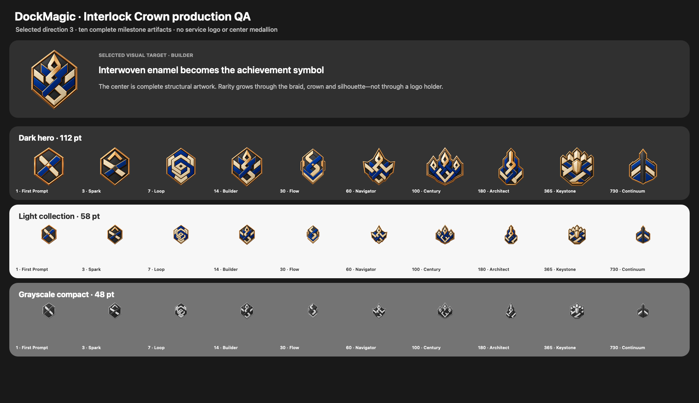

# Codex Streak — Product Research and Design Specification

## 1. Executive decision

Add **Streak** to the Codex hover dashboard as a self-relative record of
consecutive calendar days with Codex token activity. The feature should reward
showing up, not token volume, productivity, or comparison with other users.

The safest product shape is:

- one eligible day when the provider's local daily usage reports `tokens > 0`;
- a DockMagic-owned SwiftData day ledger as the source of truth;
- ten permanent milestone badges derived from the longest streak;
- a compact overview entry that opens a dedicated streak detail screen;
- small milestone celebrations, no leaderboard, no public comparison, and no
  escalating reminders;
- strict reset after a genuinely confirmed missed day, while stale, missing,
  delayed, or failed telemetry never causes a local reset.

The user can lose the current run without losing their best streak or earned
badges. This separation is the most important protection against a broken
streak turning into abandonment.

## 2. Scope and audience

- **Product:** DockMagic's Codex hover dashboard on macOS.
- **Audience:** individual developers who already use Codex and want a quick
  view of usage cadence.
- **Target behavior:** return to useful Codex-assisted work on days when Codex
  is relevant.
- **Not a target:** maximize tokens, keep developers working every weekend, or
  claim that daily activity equals productivity or shipped work.
- **Research horizon:** current public research and product patterns reviewed
  on 2026-08-30, plus the current DockMagic worktree and Codex app-server
  protocol.

## 3. Evidence and product implications

### 3.1 What is directly supported

1. A seven-study Journal of Consumer Research paper found that an intact
   logged streak increased subsequent engagement relative to a broken logged
   streak, even when the underlying behavior was held constant. The paper also
   found that an opportunity to repair a break attenuated the negative effect.
   This supports making continuity visible, but also protecting users from an
   unrecoverable all-or-nothing loss.

2. A natural experiment around GitHub's removal of public streak counters found
   that long streaks became less common, weekend activity fell, and single-
   contribution days became less common. This supports the engagement effect,
   but warns that developer streaks can steer people toward low-value activity
   and work on days they would otherwise rest.

3. Duolingo publicly describes milestone moments around one week, one month,
   100 days, one year, and beyond. It makes milestone moments more celebratory
   than ordinary days and repairs streaks affected by service failures. These
   patterns support logarithmically spaced rewards and a clear fairness rule.

4. Research on badge incentive mechanisms distinguishes fixed absolute
   standards from competitive relative standards. Streak is a personal habit
   signal, so fixed milestones are clearer and safer than percentiles,
   leaderboards, or scarce ranks.

### 3.2 Inferences for DockMagic

The following decisions are product inferences rather than claims proven by a
single source:

- Any positive token activity should qualify. A minimum-token threshold would
  be arbitrary and would encourage token waste near the threshold.
- Earned badges should remain permanent. Current streak and historical
  achievement answer different questions and should not collapse together.
- Milestones should be dense in the first month, then spread out. Early wins
  teach the mechanic; later spacing keeps the collection from becoming noisy.
- The feature should stay private by default. Social comparison is outside the
  user's goal and adds pressure without improving the core dashboard task.
- A service outage or an unavailable usage snapshot must not be represented as
  user failure.

### 3.3 Sources

- [On or Off Track: How (Broken) Streaks Affect Consumer Decisions](https://academic.oup.com/jcr/article/49/6/1095/6623414)
- [How Gamification Affects Software Developers: Cautionary Evidence from a Natural Experiment on GitHub](https://arxiv.org/abs/2006.02371)
- [Animating the Duolingo Streak](https://blog.duolingo.com/streak-milestone-design-animation/)
- [Protecting Streaks From Site Issues](https://blog.duolingo.com/protecting-streaks-from-site-issues/)
- [Incentives, Gamification, and Game Theory: An Economic Approach to Badge Design](https://doi.org/10.1145/2910575)
- [OpenAI Codex app-server protocol](https://github.com/openai/codex/blob/main/codex-rs/app-server/README.md)
- [OpenAI `AccountTokenUsageSummary` schema](https://github.com/openai/codex/blob/main/codex-rs/app-server-protocol/src/protocol/v2/account.rs)

## 4. Existing-product fit

The current 440 × 522 Codex hover dashboard already shows:

1. account identity and lifetime tokens;
2. five-hour and weekly quota windows;
3. daily token usage;
4. Ship momentum;
5. Daily intensity and top models.

Streak should not become another large dashboard card. The selected overview
integration is a shallow **Continuity Strip** placed immediately after the
daily-usage chart and before Ship momentum. It keeps Daily intensity and Top
models intact while giving streak a stable, discoverable position in both the
Codex and Claude Code dashboards. The overview shows only:

- current streak;
- the last seven calendar days;
- best streak;
- the next milestone and progress;
- a disclosure affordance to the detail screen.

Selecting the entry opens a dedicated detail screen using the same in-panel
back-navigation pattern as `CodexDailyTokenDetailView`. The detail screen owns
the complete ten-badge collection and the rules explanation.

The strip uses a single neutral inset surface rather than nested cards. The
daily chart and lower insight regions become slightly more compact so the
existing panel sizes remain unchanged. Ship momentum stays distinct: momentum
compares recent activity windows, while Streak records consecutive eligible
days.

## 5. Data contract and implementation

### 5.1 Provider inputs

Codex and Claude Code provide token-usage observations. DockMagic consumes:

- `dailyUsageBuckets[]` with `startDate` and `tokens`;
- the time at which DockMagic observed the snapshot;
- a provider identity (`codex` or `claudeCode`).

Upstream current/longest streak values are deliberately ignored. The provider
does not decide eligibility, continuity, best streak, or badge unlocks.
DockMagic maps usage into `CodexAccountTokenUsage` in:

- `DockMagic/DockMagic/Models/CodexRateLimitSnapshot.swift`;
- `DockMagic/DockMagic/Services/CodexRateLimitProvider.swift`;
- `DockMagic/DockMagic/Services/ClaudeCodeLocalTelemetryReader.swift`.

No prompt contents are persisted by the streak feature.

### 5.2 Source-of-truth rules

- The unique persistence key is `provider + local YYYY-MM-DD`.
- When today's provider bucket has `tokens > 0`, DockMagic inserts that day once
  or updates its observed token total. Repeated polling cannot extend a streak
  more than once per day.
- Codex and Claude Code keep separate ledgers, streaks, and badge progress.
- `currentDays`, `bestDays`, recent-day states, and badge unlocks are derived
  only from the persisted DockMagic ledger.
- A badge is unlocked when the locally derived `bestDays` reaches its boundary.
- Earned badges survive a current-run reset because they are derived from the
  best contiguous run across all persisted active days.
- The first release does not import historical provider streak values or
  backfill earlier token buckets. Tracking begins on the first local day that
  DockMagic observes positive usage.

### 5.3 Eligibility and day boundaries

- An eligible day is the user's local calendar day for which DockMagic observes
  a provider daily bucket with `tokens > 0`.
- Token amount above zero has no effect on streak value, badge speed, or visual
  intensity.
- Convert dates to a stable civil-day index with the user's current calendar;
  never add fixed 86,400-second intervals to determine adjacency.
- Today remains **open** until the local calendar day ends. A missing token
  bucket today does not reset yesterday's live streak.
- Once a later local day begins, a missing persisted day breaks the current run.
- A failed refresh never deletes or edits an existing active-day record.

### 5.4 Compatibility behavior

| Data state | Streak UI |
| --- | --- |
| Positive tokens today | Persist the day; show locally derived streak and badges |
| No tokens yet today | Keep today pending; yesterday's run remains current |
| Repeated provider refresh | Update the same provider/day record; never double-count |
| Stale provider snapshot | Keep persisted history; recompute day-boundary state locally |
| Provider unavailable | Do not mutate the ledger; show the provider connection state |
| App upgrade with no ledger | Begin at the first newly observed active day; no implicit import |

## 6. Streak lifecycle

```text
No activity yet
  -> DockMagic observes a positive provider token bucket today
Active streak
  -> DockMagic records the next local calendar day
Streak extended
  -> milestone crossed
Badge permanently unlocked
  -> a later local day begins with a gap in DockMagic's ledger
Current streak resets
  -> DockMagic records positive provider usage on a later day
New streak starts; best streak and badges remain
```

The reset should be stated plainly but never dramatized. The UI must not use a
red danger state, a cracked badge, loss animation, alarm language, or a modal
that interrupts work.

Recommended reset copy:

> Start a new streak today. Your best streak and earned badges are safe.

### 6.1 Repair policy

For MVP:

- never delete a recorded day because of a later provider failure or delayed
  snapshot;
- do not sell, meter, or gamify repair;
- do not add a generic streak freeze before the team can distinguish a real
  missed day from an upstream data problem.

For a later experiment, test a single 24-hour repair opportunity after a missed
day. Measure return rate and frustration against the strict-reset cohort. Do
not ship repair merely because another product uses it.

## 7. Badge system

### 7.1 Milestone ladder

| Days | Badge | Meaning | Interlock Crown motif | Celebration |
| ---: | --- | --- | --- | --- |
| 1 | First Prompt | The loop begins | Two broad ribbons cross once around a small keystone | Inline confirmation |
| 3 | Spark | Repeated intent | The crossed ribbons gain one confident upper chevron | Inline confirmation |
| 7 | Loop | One complete week | A closed angular knot completes the first continuous circuit | Small celebration |
| 14 | Builder | A repeatable rhythm | The selected full interlocked crown establishes the system | Small celebration |
| 30 | Flow | A month-scale habit | A swept S-weave creates visible forward motion | Milestone sheet |
| 60 | Navigator | Sustained direction | Four crown points establish direction without a literal compass | Small celebration |
| 100 | Century | A memorable triple-digit run | A connected triple ceremonial crown marks the tier | Milestone sheet |
| 180 | Architect | Long-term structure | A tall buttress braid rises into one central spine | Small celebration |
| 365 | Keystone | A full annual cycle | Five upper facets resolve around a dominant keystone | Milestone sheet |
| 730 | Continuum | Two years of continuity | Six paired facets converge into a distilled vertical master spine | Milestone sheet |

### 7.2 Why these intervals

- **1 and 3** teach the system without making the first reward feel distant.
- **7 and 14** align with complete-week mental models.
- **30 and 60** mark month-scale repetition without adding a badge every week.
- **100** is culturally recognizable and more memorable than 90.
- **180** bridges the large motivation gap between 100 and 365.
- **365 and 730** reward rare long-term consistency without implying a finite
  end state.

### 7.3 Collection behavior

- Show only the next badge on the overview.
- Show all ten badges on the detail screen.
- Unlocked badges appear first in reading order, but locked badges remain
  visible so the ladder is understandable.
- Each badge displays both its day requirement and name.
- Locked state uses outline, lock symbol, label, and reduced emphasis; never
  color alone.
- The selected badge may reveal earned date, requirement, description, and
  share action. Sharing is user-initiated only.
- Crossing multiple milestones from newly available historical data unlocks
  them together with one calm summary, not a chain of ten modals.

## 8. Visual system

### 8.1 Production rules

- Follow `docs/COLOR_DESIGN_SYSTEM.md` and `docs/DESIGN_SYSTEM.md`.
- Normal chrome is neutral plus `theme.action` as the one persistent accent.
- Badge artwork is shared by both services and represents only the streak
  milestone. Codex or Claude Code identity remains in the dashboard header;
  no service logo or center-medallion overlay appears inside a badge.
- No `LinearGradient`, `RadialGradient`, `AngularGradient`, colored glow,
  decorative tinted card, feature-local palette, or direct RGB/hex color.
- Badge rarity is expressed through changing silhouette, crown structure,
  faceted hierarchy, and material depth—not micro-detail or a
  bronze/silver/gold rainbow.
- Avoid flames because they encourage an anxiety-heavy metaphor and are not
  universally understood.
- Do not crop badges from a concept sheet. After visual selection, create and
  inspect individual production assets at their actual display sizes.

### 8.2 Three explored directions

#### Concept 1 — Temporal Garden

Expresses persistence as living time through growth rings, seasonal divisions,
and a sprout-to-canopy progression. It is warm and organic, but less native to
the precision of DockMagic's developer-tool context.

#### Concept 2 — Cosmic Cartography

Expresses persistence as a completed voyage through an astrolabe, a continuous
orbit, and twelve structural waypoints. It communicates long duration clearly,
but its celestial metaphor is less directly connected to making and systems.

#### Concept 3 — Signal Architecture (superseded)

Expresses persistence as a system deliberately built over time. Machined
graphite modules, bounded cobalt and ivory enamel, copper routing, and a small
mint keystone create a precise collectible language that fits DockMagic while
remaining distinct from surrounding product chrome.

Signal Architecture produced a consistent first production pass, but its thin
routing and technical micro-detail did not feel rewarding enough at 48–58 pt.

#### Pinterest refinement — Victory Crest (superseded)

Victory Crest introduced a stronger broad silhouette and premium enamel
material, but its central service-logo medallion competed with the milestone
symbol and made the collection feel like branded variants rather than earned
achievements.

#### Logo-free refinement — Interlock Crown (selected)

The selected Option 3 makes the interlocking ribbon structure the complete
symbol. A warm copper-gold rim contains graphite, warm-ivory, and cobalt enamel
with no logo, circle, blank medallion, or empty identity socket. Rarity grows
through the number of connected ribbon turns, crown points, structural height,
and silhouette authority. Each milestone is an individual transparent asset;
the 14-day Builder image is the selected visual target itself.

## 9. Interaction and celebration

### 9.1 Ordinary day

- Completing today changes the day marker and current number in place.
- Use a 0.32-second metric transition at most.
- Respect Reduce Motion by replacing movement with an immediate state change.
- Do not show a modal for an ordinary extension.

### 9.2 Milestone day

- Mark the new badge in the overview with one compact callout.
- Open the milestone sheet only from the user's dashboard interaction; do not
  interrupt an active Codex task.
- Keep the primary action **View badge** and a secondary **Share** action.
- Dismissal never affects progress.
- Show the celebration once per newly observed milestone on a device; the badge
  remains discoverable in the collection.

### 9.3 Reminder policy

- Off by default.
- If enabled, the user chooses a local reminder time.
- Maximum one reminder per eligible day.
- Stop sending after activity is confirmed.
- Never escalate tone over the course of a day.
- Do not use urgency copy such as “Your streak dies tonight.”
- Offer a direct setting to disable reminders from the notification.

Recommended reminder copy:

> Your Codex streak is open today. Use Codex when it helps your work.

## 10. UX copy

| State | Primary copy | Supporting copy |
| --- | --- | --- |
| First eligible day | `First Prompt unlocked` | `Your Codex streak starts here.` |
| Active today | `{N} day streak` | `Today is complete.` |
| Today open | `{N} day streak` | `Use Codex today to continue.` |
| Next milestone | `{D} days to {Badge}` | `Badges stay earned.` |
| New run after break | `Start a new streak today` | `Your best streak and earned badges are safe.` |
| Stale data | `Last known streak: {N}` | `Codex activity is still updating.` |
| Unsupported | `Streak unavailable` | `Update Codex to load account activity.` |

Avoid praise that claims quality or output, such as “You were productive,”
“Great shipping,” or “Power user.” Token activity alone does not prove those
outcomes.

## 11. Accessibility and appearance

- Current, complete, locked, newly unlocked, stale, and unavailable states must
  remain distinguishable in grayscale.
- Every badge has an accessibility label containing name, day requirement, and
  locked/unlocked status.
- Example: `Builder, 14-day streak badge, unlocked`.
- The collection follows milestone order in keyboard and VoiceOver navigation.
- Badge hit targets are at least 46 pt when interactive.
- Increased Contrast strengthens badge and route outlines without adding hues.
- Reduce Transparency uses the matching opaque semantic surface.
- Reduce Motion removes badge entrance, path drawing, and number interpolation.
- Light and Dark modes use semantic counterparts; the badge identity remains
  legible at a minimum 3:1 non-text contrast.
- Text and meaningful icons meet the existing 4.5:1/3:1 contrast contract.

## 12. Measurement plan

### 12.1 Success metrics

- percentage of eligible users who reach 3, 7, 14, and 30 days;
- D7 and D30 retained active-day rate;
- return rate on the day after a streak break;
- collection opens and milestone-detail opens;
- reminder opt-in, disable, and notification-to-use conversion;
- qualitative sentiment around clarity, motivation, and pressure.

### 12.2 Guardrails

- weekend share of activity;
- share of days with only one tiny Codex interaction;
- tokens per active day and abrupt near-midnight token spikes;
- reminder disable rate;
- dashboard dismissal after break copy;
- support reports about stale or incorrect streaks;
- accessibility failures and Reduced Motion violations.

An increase in daily return is not a win if it is accompanied by a material
increase in token-waste proxies, unwanted weekend work, or frustration after a
break.

### 12.3 Suggested rollout

1. Internal/dogfood: data correctness, timezone, stale state, and badge unlocks.
2. Small opt-in cohort: no reminders, observe comprehension and guardrails.
3. A/B test overview exposure: compact streak entry versus current dashboard.
4. Separately test opt-in reminders only after the base feature is healthy.
5. Test 24-hour repair only if post-break abandonment remains a real problem.

## 13. Implementation acceptance criteria

1. Current and longest streak come from `account/usage/read` when available.
2. Any `tokens > 0` day qualifies; token volume does not change progress.
3. A confirmed missed day resets current streak without removing best streak or
   any badge.
4. Stale, missing, unsupported, or partial data cannot locally break a streak.
5. Exactly ten badges use the milestone ladder in this document.
6. Every production badge is a logo-free Interlock Crown artifact. No Codex or
   Claude Code mark, blank medallion, or runtime identity overlay appears in
   the badge; service identity stays in the dashboard header.
7. Overview shows only current, recent days, best, and next milestone; the full
   collection lives in a detail view.
8. No leaderboard, social comparison, red break state, escalating reminder, or
   token-volume reward is introduced.
9. No new gradient, colored glow, decorative tint, direct color literal, or
   feature-local palette is added.
10. Light, Dark, Increased Contrast, Reduce Transparency, Reduce Motion, and
    grayscale states are inspected.
11. Unit tests cover milestone boundaries, nil/stale data, current-versus-best,
    multiple historical unlocks, and timezone presentation.
12. Render tests cover overview, detail, unlocked/locked, break, stale,
    unsupported, and milestone celebration states.

## 14. Selected direction and production handoff

The selected art direction is **Interlock Crown (Option 3)**. Production translates
that target into:



- a 62 pt continuity strip shared by Codex and Claude Code;
- a current badge, current run, seven-day state strip, best streak, and next
  milestone in the overview;
- in-panel back navigation to a scrollable detail screen;
- a large current-badge hero followed by recent activity and the complete
  ten-badge collection;
- permanent unlocks based on longest streak, with current progress remaining
  separate after a break;
- ten individual 1024 × 1024 transparent raster assets rather than crops from a
  concept sheet;
- a shared machined-enamel material language using graphite, cobalt, warm
  ivory, and a polished copper-gold rim;
- milestone-specific connected silhouettes that evolve from one rising
  ribbon crossing to a distilled six-facet vertical master spine;
- service-neutral badge interiors with no runtime logo composition; Codex and
  Claude Code remain identified by the existing logo in the dashboard header;
- no text, numerals, generated logos, flames, colored glow, rainbow outline,
  watermark, mockup, center medallion, or decorative background inside the
  badge assets.

The badge art is intentionally more expressive than the surrounding product
chrome. Its multi-color enamel remains bounded by the exception documented in
`docs/COLOR_DESIGN_SYSTEM.md`; all SwiftUI surfaces, outlines, controls, status,
and selection continue to use shared semantic roles.
