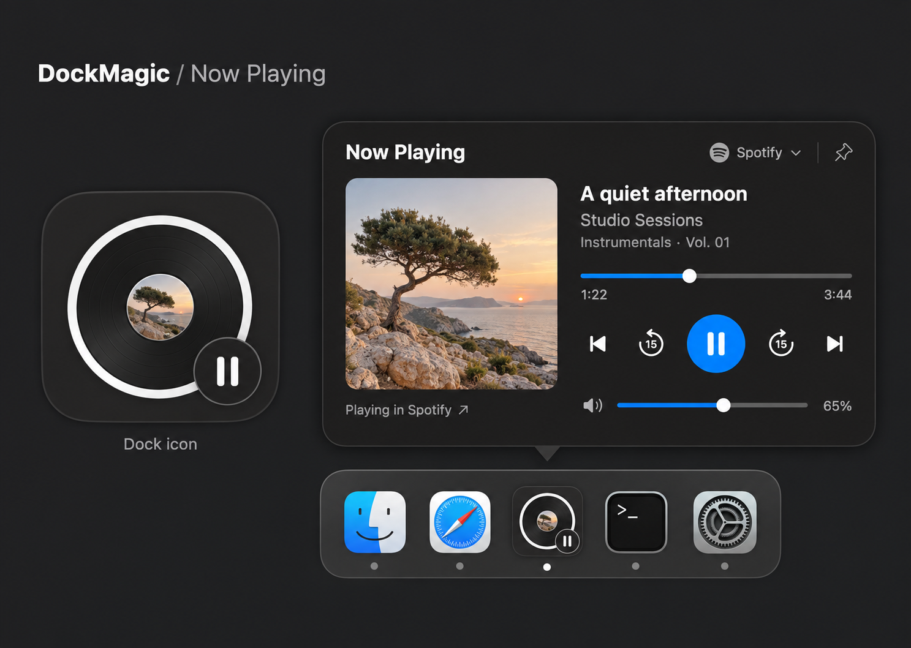

# Now Playing — kế hoạch triển khai phương án 3

Ngày: 16/09/2026. Người dùng đã chọn ảnh thứ ba trong bộ Product Design và sau đó yêu cầu triển khai. Trạng thái: **đã có bản native, đang bị chặn ở các gate kiểm chứng còn lại** bởi xác nhận quyền Automation và phiên desktop dành cho QA; chưa hoàn thành MVP. Kết quả được ghi trong [báo cáo QA](NOW_PLAYING_QA.md).

## 1. Thiết kế đã chọn



Nguồn chính xác: kết quả ImageGen thứ ba đã hiển thị, `exec-aa75c438-ca03-4bf5-a529-04e3941b24ba.png`. Bản sao được giữ trong repo để đối chiếu khi triển khai; hai phương án trước không còn là đích hình ảnh.

- **Dock icon:** nền vuông bo góc trung tính, đĩa tối với viền sáng, ảnh album tròn ở tâm, badge transport ở góc phải dưới. Không xoay đĩa, không thêm vòng tiến độ.
- **Dashboard ngang:** ảnh album ở cột trái; tên bài, nghệ sĩ, album, seek, transport và volume ở cột phải. Header có Now Playing, nguồn và pin. Dưới ảnh có hành động mở ứng dụng nguồn.
- **Tương tác chính:** previous, lùi 15 giây, play/pause, tiến 15 giây, next; kéo seek/volume; Auto/Spotify/Apple Music; ghim.
- **Công nghệ:** SwiftUI/AppKit trong ứng dụng macOS DockMagic hiện tại. Bản thiết kế không phải yêu cầu tạo website hoặc thêm frontend runtime.

Các giá trị đầu vào để dựng native: panel rộng khoảng **560 pt**, cao theo nội dung khoảng **332–348 pt**, ảnh album khoảng **208–216 pt**, gap hai cột **24 pt**, padding **24 pt**, nút chính **48 pt**. Đây là kích thước khởi điểm đo từ hình đã chọn; điều chỉnh theo typography thật để giữ bố cục và tránh clipping. Pointer/shadow do host tính riêng, không cộng padding hai lần.

Giữ `DesignTheme`, `DockHoverChrome`, SF typography, radius/spacing hiện có. Màu của album chỉ ở vùng ảnh. Những hiệu ứng ánh sáng do ảnh concept sinh ra không trở thành gradient hoặc glow trong UI. Light, Dark và accessibility dùng cùng hệ thống semantic; không tạo palette riêng cho âm nhạc.

## 2. Phạm vi bản đầu và quyết định UX

### Thuộc MVP

- Spotify desktop và ứng dụng Music trên Mac, kết nối riêng bằng Automation.
- Metadata, artwork, play/pause, previous/next, seek có điều kiện, volume ứng dụng.
- Now Playing trong Settings, lựa chọn active Dock feature, dashboard hover và mở trực tiếp.
- Ghim trong phiên hiện tại; không tự mở lại panel ghim sau khi khởi động app.
- Nguồn Auto/manual; lỗi, quyền và capability được quản lý độc lập từng nguồn.

### Để sau MVP

Queue, lyrics đồng bộ, browser playback, Spotify Connect/điều khiển thiết bị từ xa, shuffle/repeat, global hotkey, lịch sử nghe, tự chuyển active feature theo nhạc và animation đĩa quay.

### Hành vi được chốt cho kế hoạch

1. Chọn Now Playing qua active feature như các tính năng hiện có; có nhạc không tự thay feature khác.
2. Hover không lấy focus khỏi ứng dụng đang làm việc. Đường `Open Now Playing` qua menu/Settings cho phép dùng bàn phím.
3. Click Dock giữ đường mở Settings hiện tại. Badge trên icon không phải vùng bấm độc lập.
4. Badge dùng cùng glyph với transport như hình: đang phát hiện pause; tạm dừng hiện play; không có transport khả dụng thì bỏ badge. Accessibility luôn đọc trạng thái thật, ví dụ `Playing — … in Spotify`, tránh đọc pause glyph thành trạng thái paused.
5. Nếu cả hai app cùng phát, Auto giữ nguồn hiện tại đang phát. Nếu chưa có nguồn, ưu tiên nguồn vừa được người dùng chọn; sau đó dùng thứ tự ổn định đã định nghĩa trong resolver. Header luôn ghi nguồn nhận lệnh.
6. Đổi nguồn không pause, resume hoặc chuyển playback giữa các app. Khi người dùng chọn nguồn cụ thể, không âm thầm gửi lệnh sang app khác nếu nguồn đó lỗi.
7. Hết playback giữ bài đang pause còn hợp lệ; app quit/timeout có trạng thái riêng. Không chuyển trường thiếu thành 0.
8. Ghim giữ panel khi rời chuột, vẫn cho phép làm việc ở app khác. Escape/đóng panel hủy ghim. Đổi active feature hoặc tắt Now Playing đóng panel và dừng công việc không còn cần thiết.
9. Seek và volume giữ source/track mục tiêu trong suốt thao tác. Nếu track hoặc source đổi, hủy thao tác cũ và đồng bộ lại.
10. Tiếp tục pipeline `applicationIconImage`: hình đĩa cũng xuất hiện ở Command-Tab như các Dock feature hiện nay. Tách riêng icon Command-Tab không thuộc thay đổi này.

## 3. Nền tảng hiện có đã kiểm tra

| Thành phần hiện tại | Cách tích hợp |
| --- | --- |
| `Models/DockConfiguration.swift` | Thêm `.nowPlaying`, presentation và mapping tương ứng |
| `Views/Dock/DockMetricsView.swift` | Gắn renderer mới tại `DockTileView.tileContent` |
| `Services/DockIconRenderingRules.swift` | Giữ canvas 512 pt × 2 = 1024 px, `contentFraction = 824/1024` chỉ áp dụng một lần |
| `Services/DockTileController.swift` | Tiếp tục pipeline render icon hiện tại; không cập nhật icon theo từng nhịp seek |
| `Views/Hover/CodexHoverDashboardView.swift` | `DockHoverDashboardRoot` hiện nằm ở đây; thêm nhánh Now Playing trong root, giữ nội dung music ở file riêng |
| `Services/DockHoverCoordinator.swift` | Chứa placement, observer, panel controller và panel class; hiện chưa có pin và `canBecomeKey` là false |
| `Stores/DockAppModel.swift` | Sở hữu store, kết nối lifecycle và presentation |
| `Stores/DockPreferencesStore.swift` | Nguồn bật, nguồn ưu tiên, Auto/manual, khoảng tua |
| `Views/Settings/SettingsView.swift` | Thêm destination/sidebar và điều hướng tới Settings riêng |
| `App/DockMagicApp.swift` | Menu mở dashboard, dependency injection và fixture dành cho UI test |
| `Info.plist`, `DockMagic.entitlements` | Bổ sung mô tả/quyền Apple Events, giữ nguyên quyền Calendar/Location đang có |

Worktree đang có thay đổi Calendar và các integration AI ở một số file dùng chung. Mỗi lần sửa phải đọc diff mới nhất, chỉ thêm nhánh cần thiết và giữ toàn bộ thay đổi ngoài phạm vi. Không phục hồi file về phiên bản cũ trong báo cáo nghiên cứu.

## 4. Các mốc thực hiện

### Mốc A — Dựng UI native bằng fixture

Tạo snapshot/capability tối thiểu để view chỉ nhận dữ liệu và action closures, chưa phụ thuộc ứng dụng nhạc thật.

- `NowPlayingHoverDashboardView`: hai cột theo ảnh thứ ba, title đủ chỗ, timeline, transport, app volume, source picker và pin.
- `DockNowPlayingView`: đĩa, ảnh tâm và badge; không bake cả dashboard hay metadata vào bitmap.
- Asset gốc cho fixture: ảnh album tách riêng, đúng góc nhìn và sắc độ mẫu; lấy từ asset phù hợp hoặc tạo bằng ImageGen. Nếu icon cần asset riêng, xuất từng layer đủ độ phân giải để artwork ở tâm vẫn thay được theo bài thật. SF Symbols dành cho control icons.
- States bằng fixture: playing, paused, no artwork, tên bài dài, unknown duration, seek unavailable, loading, chưa kết nối và app chưa chạy.
- Preview trong môi trường native và fixture của app; không hiển thị demo như dữ liệu thật ở luồng người dùng.

**Đầu ra:** ảnh render icon 32/48/64/128 pt, ảnh dashboard Light/Dark và một bản preview native dùng dữ liệu mẫu. Đối chiếu với ảnh đã chọn ở cùng crop/tỉ lệ; sửa khoảng cách, tỷ lệ đĩa, typography và crop artwork trước khi nối live data.

### Mốc B — Hoàn thiện host hover, pin và keyboard

- Bổ sung presentation policy tối thiểu: transient hover và explicit interactive/pinned. Mặc định của những dashboard cũ giữ nguyên.
- Hover vẫn có delay hiện tại, không giành focus. Click tương tác/mở trực tiếp có đường nhận key focus để Tab, Space, arrow keys và Escape hoạt động.
- Pin chặn auto-dismiss khi mouse exit; đổi feature/disable feature vẫn đóng đúng.
- Đang mở source menu hoặc kéo slider không bị scheduleHide đóng panel giữa thao tác.
- Khi menu Dock mở, ẩn transient panel; panel đang ghim có thể tạm ẩn và phục hồi sau menu đóng nếu feature chưa đổi. Không để panel nằm đè lên menu.
- Explicit open không phụ thuộc vào việc người dùng đang hover. Nếu chưa có AX anchor, mở panel tại vị trí an toàn trên màn hình hiện tại; có thể dùng mọi control mà không phải xin Accessibility chỉ để mở cửa sổ.
- Kiểm tra pointer và clamp tại Dock dưới/trái/phải, nhiều màn hình, magnification, auto-hide và fullscreen.

**Đầu ra:** thao tác đầy đủ trên fixture; không đóng mất panel khi kéo seek/chọn nguồn, và không đổi hành vi hover của Calendar/Weather/AI.

### Mốc C — Chứng minh kết nối local trong app ký thật

Tạo `SpotifyPlaybackProvider` và `AppleMusicPlaybackProvider` qua API Apple Events công khai, ưu tiên ScriptingBridge wrapper có timeout/error handling và worker tuần tự rõ ràng.

- Kiểm tra app đã cài/chạy qua `NSWorkspace`; refresh thông thường không khởi chạy app nguồn.
- Chỉ thao tác Connect mới được phép yêu cầu Automation. Tách trạng thái chưa hỏi, được cấp, bị từ chối và app không tồn tại.
- Bổ sung `NSAppleEventsUsageDescription` và `com.apple.security.automation.apple-events`; kiểm tra từ bundle mang danh tính DockMagic, không lấy thành công trong Terminal làm bằng chứng quyền của app.
- Đọc metadata, artwork, state, position/duration và volume; chạy thử command. Chuẩn hóa đơn vị duration riêng từng nguồn bằng bài có thời lượng biết trước.
- Kiểm tra quyền bị thu hồi, app quit, timeout, bài local/streaming và nội dung không seek được. Không hứa hỗ trợ mọi nội dung hoặc tài khoản chỉ từ scripting dictionary.
- Spotify artwork dùng URL được báo; Music dùng artwork data nếu có. Thiếu artwork không chặn transport.

**Đầu ra:** bảng capability đã chạy thật cho hai nguồn và bằng chứng lỗi/quyền. Chỉ bật điều khiển ứng với dữ liệu/context đã xác nhận. Bằng chứng API hiện có nằm trong [nghiên cứu](NOW_PLAYING_RESEARCH.md); runtime còn phải thực hiện.

### Mốc D — Store, command routing và dữ liệu thật

Mô hình dự kiến:

```text
SpotifyPlaybackProvider ─┐
                        ├─ NowPlayingStore ── NowPlayingHoverDashboardView
AppleMusicPlaybackProvider┘        │
                                 └─ NowPlayingDockPresentation ── DockNowPlayingView
                         Commands ── source/track đã chọn
```

- Snapshot là value type; artwork có identity/revision riêng. Không đưa đối tượng `SBObject` hoặc work blocking lên SwiftUI/MainActor.
- `NowPlayingSourceStatus` tách permission/connection khỏi playback. `PlaybackCapabilities` là khả năng theo nguồn/context, không mặc định cả hai giống nhau.
- `NowPlayingStore` giữ snapshot từng nguồn, resolver Auto/manual, observation timestamp, command-in-flight và error có thể phục hồi.
- Render icon dùng presentation rút gọn gồm artwork revision và playback/availability; position/volume thay đổi không khiến icon bị rasterize lại.
- Khởi điểm polling: 1 giây khi panel đang hiển thị và phát; 3–5 giây khi chỉ cần icon theo bài; backoff khi paused/no media; ngừng khi feature không được dùng. Điều chỉnh bằng đo thực tế.
- Seekbar nội suy theo đồng hồ đơn điệu khi snapshot còn mới và playing; paused/stale thì dừng. Sau lệnh và wake phải đọc lại provider.
- Seek preview tại UI, gửi giá trị cuối khi thả. Volume coalesce/throttle; mọi command có timeout và cập nhật lại giá trị đã xác nhận khi lỗi. Không tự retry lệnh toggle có thể đảo trạng thái hai lần.
- Artwork cache giới hạn dung lượng, hủy tác vụ bài cũ, kiểm tra source/track khi completion; album và icon phải dùng cùng một artwork revision.

**Đầu ra:** dashboard và Dock theo cùng nguồn/bài; không có command gửi nhầm app/track, không bị ảnh bài cũ ghi đè, không có polling dư khi feature đã dừng.

### Mốc E — Settings và khả năng phục hồi

- `NowPlayingSettingsView` tái sử dụng section/row/status component và native controls hiện có.
- Hai hàng Spotify/Apple Music: tình trạng cài đặt, kết nối, bật/tắt, Connect hoặc Open App/Privacy Settings tùy trạng thái thật.
- Chọn Auto/manual và khoảng tua 5/10/15/30/60 giây; mặc định 15. Không thêm lựa chọn kiểu icon hoặc layout khác sau khi đã chọn phương án 3.
- Preview dùng đúng renderer sản phẩm. Nút `Open Now Playing` cho phép kiểm tra dashboard trực tiếp.
- Accessibility để theo dõi hover Dock và Automation để điều khiển app là **hai quyền độc lập**. Không hiện Connect Spotify khi vấn đề thật nằm ở quyền hover, và ngược lại.
- Unknown duration hiển thị giá trị chưa biết, disable seek có giải thích. No media, disconnected, source stopped và paused không dùng chung một empty state.
- Đổi nguồn lỗi không làm mất thông tin của nguồn còn lại; các thông báo lỗi chỉ chiếm vùng cần thiết của panel.

**Đầu ra:** người dùng tự đi từ chưa kết nối tới điều khiển nhạc và biết cách phục hồi khi quyền hoặc ứng dụng nguồn gặp vấn đề.

### Mốc F — Kiểm chứng và bàn giao

| Nhóm | Tiêu chí |
| --- | --- |
| Logic | Auto resolver; cả hai app phát; thiếu timestamp/duration; seek clamp; stale; timeout; track đổi giữa lệnh; completion cũ; hủy polling |
| UI fixtures | Playing/paused/loading/no media/no artwork/denied/stale/seek disabled/tên dài; label và focus rõ ràng |
| Native interaction | Hover → panel → source menu; kéo seek/volume; pin/unpin; Escape/Tab/Space; explicit open; app launch/quit/sleep/wake |
| Appearance | Light, Dark, Increased Contrast, Reduce Transparency, Reduce Motion và grayscale; không dựa riêng vào màu |
| Dock | 32/48/64/128 pt; nguồn raster1024px; không inset hai lần; badge không bị cắt; kiểm tra Command-Tab và Dock thật ở các cạnh |
| Provider runtime | Spotify và Music riêng rẽ/cùng chạy; grant/deny/revoke trong bundle DockMagic; lỗi một nguồn không chặn nguồn còn lại |
| Regression | Các mapping feature/Settings/presentation, Calendar và các dashboard dùng chung hover/placement |
| Performance | Không sinh process mỗi frame; không polling/tải ảnh khi không cần; đo số request, CPU và memory trước/sau |

Chạy build và test phù hợp trong project hiện tại. Dùng `./script/build_and_run.sh --verify` để kiểm chứng khởi động sau khi build; script này không chứng minh transport, quyền hay UI hoạt động, và nó dừng instance DockMagic đang chạy. Đối chiếu ảnh UI native với ảnh mục tiêu ở cùng crop/tỉ lệ. Preview hoặc unit test không thay thế Dock compositor và TCC runtime.

Trước phát hành trực tiếp: kiểm chứng Developer ID + Hardened Runtime, notarization và stapling theo quy trình release của DockMagic. Không phát hành, upload hay thay đổi phân phối trong phạm vi lập kế hoạch này.

**Hoàn thành MVP khi:** icon/dashboard khớp phương án 3; transport đúng nguồn và đúng trạng thái; người dùng kết nối/khôi phục được; không lỗi host/focus; kiểm chứng UI, provider runtime và các regression liên quan đã có bằng chứng riêng.

## 5. Tổ chức file dự kiến

```text
Models/NowPlaying.swift
Models/NowPlayingConfiguration.swift
Services/NowPlayingProvider.swift
Services/AppleEventsPlaybackClient.swift
Services/SpotifyPlaybackProvider.swift
Services/AppleMusicPlaybackProvider.swift
Services/NowPlayingArtworkCache.swift
Stores/NowPlayingStore.swift
Views/Dock/DockNowPlayingView.swift
Views/Hover/NowPlayingHoverDashboardView.swift
Views/Settings/NowPlayingSettingsView.swift
DockMagicTests/NowPlayingStoreTests.swift
DockMagicTests/NowPlayingProviderTests.swift
DockMagicTests/NowPlayingRenderingTests.swift
DockMagicUITests/NowPlayingUITests.swift
```

Tên và số lượng file có thể gộp khi code nhỏ; không thêm tầng abstraction chỉ để đáp ứng sơ đồ. Cập nhật project target và các switch exhaustiveness dựa trên source tại lúc triển khai. Document hướng dẫn người dùng/contract sau MVP nằm ở `docs/NOW_PLAYING.md`; báo cáo nghiên cứu và kế hoạch này giữ vai trò lịch sử quyết định.

## 6. Thứ tự và mốc xem lại

Trạng thái tại lần QA hiện tại:

| Mốc | Trạng thái |
| --- | --- |
| A — UI native | Đã dựng icon/dashboard theo phương án 3; có fixture và render matrix |
| B — Host và tương tác | Đã kiểm tra mở trực tiếp, nguồn, transport, slider, pin/unpin, Space và Escape bằng fixture; còn Dock hover và một số đường focus/lifecycle |
| C — Kết nối thật | Đã có Apple Events client; chờ xác nhận quyền để thử Spotify/Apple Music thật |
| D — Store | 15/15 test logic/render đạt, gồm stale, routing, hủy polling và completion cũ; chưa thay thế bằng chứng provider thật |
| E — Settings | Đã tích hợp, kiểm tra mở dashboard và các trạng thái quyền bằng fixture |
| F — Nghiệm thu | Debug build/chữ ký và 5 test hồi quy đạt; UI tự động, runtime provider và các gate còn lại được theo dõi trong báo cáo QA |

**Chưa đánh dấu hoàn thành MVP** khi các gate runtime còn thiếu.

**A → B → C → D → E → F.** A/B cho thấy UI native dùng fixture trước; C chứng minh khả năng local trước khi D nối toàn bộ. Có thể chuẩn bị cấu trúc Settings cùng C, nhưng không trình bày mock connection như kết nối thật.

Mốc xem lại đầu tiên là **icon trên Dock thật + dashboard ngang native bằng dữ liệu mẫu**, kèm Light/Dark, playing/paused và ảnh so sánh với phương án 3. Các mốc tiếp theo hoàn thiện kết nối và kiểm chứng. Kế hoạch và ảnh đã chọn được lưu trước khi triển khai. Trạng thái triển khai và phạm vi đã kiểm chứng hiện nằm trong [báo cáo QA](NOW_PLAYING_QA.md).
