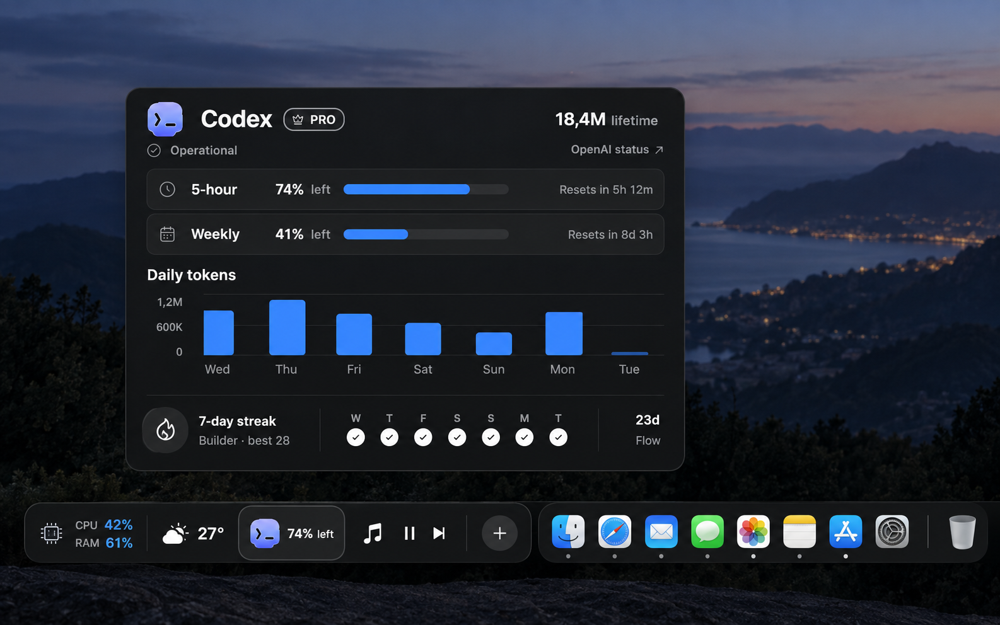

# DockMagic Shelf — nghiên cứu UI, UX và khả thi kỹ thuật

> **Yêu cầu mới nhất (2026-09-20):** Dock Active và Shelf là hai mode loại trừ.
> Shelf theo hướng Dockset: một Custom Dock dạng segment với nhiều slot, kể cả
> slot lặp cùng feature; mỗi slot dùng đúng UI Dock tile hiện có. Ô `+` viền nét
> đứt luôn ở cuối. Đây là bề mặt riêng do DockMagic sở hữu, không phải API nhúng
> widget vào Apple Dock. Xem [nghiên cứu mode mới](dockset-modes-2026-09-20.md)
> và [review mã cũ](review-2026-09-20.md). Phần dưới là lịch sử nghiên cứu, không
> phải thiết kế hiện hành.

**Ngày:** 2026-09-19  
**Trạng thái:** Tài liệu nghiên cứu lịch sử; Shelf đã được triển khai và kiểm thử bước đầu trên macOS 26.2. Xem [nghiệm thu 2026-09-20](acceptance-2026-09-20.md) để biết kết quả và giới hạn hiện tại.  
**Phương án được chọn:** Phương án 1, dải chỉ số gọn đặt cạnh Dock và dashboard hiện khi hover.

> **Quyết định triển khai mới hơn (2026-09-19):** Shelf chỉ được nằm cùng hàng/cột với Apple Dock. Khi thiếu chỗ, rút gọn ô rồi dùng overflow; nếu các control tối thiểu vẫn không vừa thì ẩn Shelf và báo lý do trong Settings. Không dùng phương án đặt phía trên hoặc đè lên Dock được đề xuất trong tài liệu nghiên cứu ban đầu. Các đề xuất fallback phía trên Dock ở những mục dưới đã bị thay thế. Xem [kết quả thử runtime](feasibility-2026-09-19.md) và [nghiệm thu](acceptance-2026-09-20.md).

> Ảnh trên là bản diễn họa luồng tương tác, không phải ảnh chụp app đang chạy. Các số liệu, lịch sử, nhãn và tỷ lệ kích thước trong ảnh chỉ có tính minh họa.

## 1. Kết luận nghiên cứu

**Có thể làm một DockMagic Shelf riêng** bằng cửa sổ AppKit chứa SwiftUI, neo cạnh Apple Dock. Có thể cho người dùng thêm, xóa, sắp xếp feature và hover vào từng ô để mở dashboard hiện có. DockMagic đã có tiền lệ `NSPanel` cho dashboard khi hover icon Dock của chính app.

**Không thể cam kết nhúng một thanh UI tương tác, rộng nhiều ô, thành một phần của Apple Dock bằng public API.** [`NSDockTile`](https://developer.apple.com/documentation/appkit/nsdocktile) cho app đổi hình vẽ và badge của tile, không cung cấp vùng bố cục tương tác nhiều ô hay API yêu cầu Dock dành chỗ. Một sản phẩm cùng lĩnh vực, [Dockset](https://dockset.app/manual/choose-your-dock-setup), cũng phân biệt rõ widget trong custom Dock riêng với Apple Dock. [Docktor](https://docktorapp.com/) mô tả widget nằm **cạnh** Dock; đây là tham khảo sản phẩm, không phải bằng chứng API.

**Điều kiện quan trọng:** Vị trí *cùng hàng, bên trái Dock* trong mockup phụ thuộc vào khoảng trống thực tế. Dock có thể đổi cỡ, phóng đại, tự ẩn, chuyển cạnh và thay số lượng app; người dùng kiểm soát các thiết lập đó trong [macOS](https://support.apple.com/en-nz/guide/mac-help/mchlp1119/mac). Không có API công khai để bắt Dock co lại hoặc chừa chỗ cho Shelf. Bởi vậy, coi “cùng hàng” là chế độ ưu tiên có điều kiện; nếu không đủ chỗ, đặt Shelf sát phía trên Dock (hoặc phía trong màn hình khi Dock ở cạnh trái/phải), không phủ lên Dock. **Chế độ cùng hàng chưa được kiểm chứng bằng prototype.**

### Mức tin cậy

| Kết luận | Mức tin cậy | Căn cứ |
| --- | --- | --- |
| Không thể nhúng thanh tương tác nhiều ô vào Apple Dock bằng API công khai | Cao | Phạm vi [`NSDockTile`](https://developer.apple.com/documentation/appkit/nsdocktile) và `contentView` là vẽ tile |
| Có thể tạo Shelf dạng cửa sổ riêng | Cao | AppKit [`nonactivatingPanel`](https://developer.apple.com/documentation/appkit/nswindow/stylemask-swift.struct/nonactivatingpanel); DockMagic đã dùng `NSPanel` cho hover dashboard |
| Luôn đặt Shelf cùng hàng mà không va chạm Dock | Thấp | Chưa có thử nghiệm; không điều khiển được kích thước/vị trí Dock; `visibleFrame` loại vùng Dock và thay đổi theo cấu hình ([Apple](https://developer.apple.com/documentation/appkit/nsscreen/visibleframe)) |
| Shelf theo kịp tự ẩn, phóng đại, nhiều màn hình, Mission Control | Chưa xác nhận | Cần prototype và kiểm thử trên từng trạng thái |
| Dashboard nhiều feature chạy đồng thời với tải chấp nhận được | Trung bình | Phụ thuộc provider, tần suất cập nhật và vòng đời dữ liệu; chưa đo |

## 2. UI: chuyển mockup thành đặc tả sản phẩm

### Cấu trúc

1. **Shelf:** một dải nền trung tính, opaque, góc bo theo Maia; phần chrome không mang màu của feature. Các ô feature chỉ có một hoặc hai số liệu quan trọng, đủ đọc ở kích thước nhỏ.
2. **Ô feature:** vùng bấm độc lập gồm identity, giá trị chính và nhãn ngắn khi cần. Trạng thái hover/focus là neutral; giá trị dữ liệu được phép dùng màu dữ liệu bên trong phần renderer theo `UI-010`. Không tô màu nền cả ô theo thương hiệu.
3. **Nút `+`:** luôn hiện, tối thiểu 36 pt hit target. Mở danh sách feature có tìm kiếm; feature đã thêm có trạng thái rõ, feature chưa có dashboard được giải thích hoặc không cho thêm trong bản đầu.
4. **Tay nắm di chuyển:** một vùng nhỏ và có affordance riêng ở đầu Shelf; không cho kéo bằng toàn bộ nền vì dễ kéo nhầm khi người dùng bấm ô.
5. **Dashboard:** chỉ một dashboard hiện tại một thời điểm, neo trên ô đang hover; tái sử dụng dashboard production và chrome không mũi tên theo `UI-017`. Khi chuyển hover sang ô khác, cập nhật nội dung/anchor có delay ngắn để tránh nhấp nháy.

### Kích thước đề xuất để thử, chưa chốt token

Chiều cao dải khoảng **52–64 pt**; ô compact rộng theo nội dung, mục tiêu **72–136 pt**; gap/padding theo thang **4/8/12/16 pt**. Chữ dùng Geist qua `DSTypography`, icon app-owned dùng `DSIcon`/HugeIcons, target bấm tối thiểu **36 pt** như [Design.md](../../../Design.md). Không ép cả mockup rộng vào màn hình nhỏ: ưu tiên tối đa **3–4 ô** nhìn thấy, còn lại vào mục “Thêm/Xem tất cả” trong Shelf hoặc trang quản lý. Số ô chính xác là kết quả thử trên màn hình thật, không phải giá trị cố định từ ảnh.

### Điểm cần sửa so với ảnh concept

- Bản ảnh chỉ có Dark; phải thiết kế Light, Increased Contrast, Reduce Transparency, grayscale và Reduce Motion. App-owned surface phải opaque theo `UI-011`; không sao chép hiệu ứng kính/tối mờ từ ảnh.
- Ảnh không có tay nắm kéo, trạng thái focus, loading, stale, lỗi và quá hẹp; cần các trạng thái đó trước khi hoàn thiện UI.
- Những identity màu CPU/RAM, Now Playing, v.v. hiện được `UI-009` cho phép ở sidebar và vùng logo Active Dock Feature, **chưa cho phép ở Shelf**. Bản thiết kế sản phẩm phải dùng bản monochrome trong Shelf, hoặc sau khi duyệt mới mở rộng hợp đồng màu một cách tường minh.
- Số liệu Codex/biểu đồ trong ảnh là giả lập. Production phải đọc đúng dữ liệu hiện có, thời điểm cập nhật và khoảng thời gian của provider; không lấy số trong ảnh làm fixture hay hứa nội dung không có dữ liệu.
- Dashboard Codex trong ảnh lớn hơn nhiều so với dải; cần clamp vào đúng `NSScreen.visibleFrame` để không ra ngoài màn hình.

## 3. UX: hành vi đề xuất

| Tình huống | Hành vi đề xuất |
| --- | --- |
| Bật Shelf lần đầu | Bật từ Settings, thấy preview và lời giải thích rằng đây là dải riêng **cạnh** Dock. Mặc định rỗng với `+`, hoặc gợi ý CPU/RAM, Weather, Codex, Now Playing nếu các feature đã được cấu hình. Không tự đổi `activeFeature` của tile Dock. |
| Bấm `+` | Mở `DSSelect` có tìm kiếm và identity nhất quán với sidebar/Active Dock picker (`UI-016`). Thêm một feature một lần, không trùng; lưu thứ tự. |
| Hover ô | Dwell thử nghiệm 300–500 ms rồi mở dashboard; rời sang dashboard có vùng chuyển chuột/grace period. Đây là tham số cần thử, **không thay** quy tắc 1 giây của hover icon Dock (`UI-015`). |
| Bấm ô / keyboard / VoiceOver | Mở cùng dashboard để không phụ thuộc hover; bấm lần nữa hoặc Escape đóng. VoiceOver đọc tên, giá trị, tuổi dữ liệu và hành động. Full Keyboard Access phải tới được mọi ô và `+` ([Apple HIG](https://developer.apple.com/design/human-interface-guidelines/keyboards)). |
| Sắp xếp/xóa | Kéo ô trong Shelf hoặc dùng mục “Move left/right”, “Remove from Shelf” ở context menu/trang quản lý; không cho xóa bằng một cú click thường. |
| Bấm icon DockMagic trong Apple Dock | Giữ nguyên `UI-015`: mở Settings ngay, đóng dashboard trước nếu đang mở. Shelf và dashboard của Shelf không chiếm quyền điều hướng của Dock icon. |
| Mất dữ liệu/quyền | Giữ chỗ ô, hiển thị “Đang tải”, “Cập nhật lần cuối…”, “Cần kết nối” hoặc lỗi có hành động; không biến missing thành 0. Không tự hiện prompt TCC chỉ vì hover. |
| Nhiều ô/dải thiếu chỗ | Rút gọn số ô và cung cấp overflow. Không che hay ép kích thước Apple Dock. |

**Quyết định về feature không có dashboard:** phiên bản đầu chỉ cho thêm feature có `hasHoverDashboard == true`, hoặc ô không có dashboard phải có một chi tiết ngắn được thiết kế và duyệt riêng. Tránh để người dùng thêm một ô rồi hover không có phản hồi. Hiện `DockFeature` báo có dashboard cho System Metrics, Weather, Calendar, Now Playing, Codex, Claude Code, Antigravity, OpenCode, Binance và Grok Build khi experimental gate bật. Network, Storage, Clock, Batteries, GitHub, Search Console và DockMagic hiện không có dashboard.

**Quyền riêng tư:** quota, nhạc, lịch và tài chính có thể lộ trên màn hình chia sẻ. Settings nên có “Ẩn giá trị nhạy cảm trên Shelf” và tuỳ chọn tắt Shelf nhanh. Chỉ hiển thị tóm tắt, không credential, repository URL nhạy cảm hay token.

## 4. Kỹ thuật: kiến trúc phù hợp với code hiện tại

### Những gì đã có trong repo

- [`DockHoverCoordinator.swift`](../../../DockMagic/DockMagic/Services/DockHoverCoordinator.swift) dùng AX observer để tìm **icon DockMagic**, xác định frame và mở `NSPanel` không kích hoạt app. Nó đã xử lý permission và recovery cơ bản. Đây là điểm tái sử dụng kỹ thuật, nhưng logic hiện chỉ dành cho hover **một icon**.
- [`DockHoverDashboardRoot.swift`](../../../DockMagic/DockMagic/Views/Shared/DockHoverDashboardRoot.swift) chọn nội dung bằng `preferences.activeFeature`. Để Shelf có nhiều ô, dashboard phải nhận **feature được hover** làm đầu vào, độc lập với feature đang render trong Dock.
- [`DockAppModel.swift`](../../../DockMagic/DockMagic/Stores/DockAppModel.swift) `applyPreferences()` khởi động/tạm dừng nhiều store theo `activeFeature`. Codex và Claude Code đã có monitoring độc lập; Now Playing có `setInterest`; các store khác có chính sách riêng. Không thể giả định mọi store cần start lại hoặc mọi store đang chạy sẵn.
- [`DockPreferencesStore.swift`](../../../DockMagic/DockMagic/Stores/DockPreferencesStore.swift) mới lưu một `activeFeature`; Shelf cần trạng thái riêng: enabled, danh sách có thứ tự, display/placement và tùy chọn privacy. Migrate an toàn: cài đặt cũ mặc định Shelf off, Dock tile không đổi.
- [`SettingsView.swift`](../../../DockMagic/DockMagic/Views/Settings/SettingsView.swift) có `DockFeatureIcon` nhưng đang là `private`; danh sách `+` và Shelf cần dùng chung identity, theo `UI-016` và `UI-009`.

### Thành phần đề xuất, chưa tạo file

| Thành phần | Nhiệm vụ |
| --- | --- |
| `ShelfConfiguration` | Lưu enabled, ordered feature IDs, placement preference, privacy mode; chuẩn hóa ID không còn tồn tại và tránh trùng |
| `ShelfWindowController` | Sở hữu một `NSPanel`/`NSWindow` lâu dài, host SwiftUI, xử lý z-order/focus/hit testing và show/hide |
| `DockGeometrySource` | Đọc màn hình/Dock edge và bounds một cách có kiểm soát; ưu tiên dữ liệu AX hiện có khi được cấp quyền, có fallback không đè Dock |
| `ShelfPlacementEngine` | Tính vị trí theo Dock, màn hình, kích thước Shelf/dashboard; pure geometry có thể test; phát hiện thiếu chỗ và chọn fallback |
| `ShelfFeaturePresentation` | Trích một snapshot nhỏ từ mỗi provider, gồm `value`, `status`, `updatedAt`, accessibility label; không ép dashboard vào ô nhỏ |
| `FeatureInterestCoordinator` | Gộp nhu cầu `Dock tile` + `Shelf visible` + `dashboard open`; quản lý sampling/cache riêng theo provider, tránh polling trùng |
| `DashboardCoordinator` | Nhận source (`Dock icon`/`Shelf`) và feature cụ thể; một dashboard tại một thời điểm; giữ interaction lease cho popup/menus |

### Vị trí và cửa sổ

`NSScreen.visibleFrame` mô tả vùng an toàn **không gồm Dock/menu bar** và có thể thay đổi ngay khi Dock tự ẩn ([Apple](https://developer.apple.com/documentation/appkit/nsscreen/visibleframe)). Muốn cùng hàng với Dock phải xét `screen.frame` và geometry thực của Dock, không chỉ `visibleFrame`. AX tree có thể cho frame của Dock list/items nhưng cấu trúc này là dependency hành vi, không phải hợp đồng bố cục chính thức của Dock. Cần đo trên máy thật xem frame có bao gồm nền, Trash, app mới, magnification hay không.

Đừng sao chép `windowLevel = popUpMenu + 1` của hover dashboard để dùng cho Shelf: Shelf luôn hiện có thể che menu và cửa sổ khác. Apple xếp window level theo thứ tự rõ ràng; `NSWindow.Level.dock` đã deprecated và không có replacement ([Apple](https://developer.apple.com/documentation/appkit/nswindow/level-swift.struct/dock)). Chọn level sau khi đo hit testing, menu, focus và full-screen. [`NSWindow.CollectionBehavior`](https://developer.apple.com/documentation/appkit/nswindow/collectionbehavior-swift.struct) có các tùy chọn Spaces/Mission Control/Stage Manager nhưng một số flag loại trừ nhau. Không suy luận rằng panel sẽ đi theo Dock trên mọi Space chỉ bằng cách bật `canJoinAllSpaces`.

Nếu Shelf cần bám theo Dock khi auto-hide, cần phân biệt **Dock hiện** và **Dock ẩn** bằng sự kiện/quan sát public đáng tin cậy. Đây là rủi ro cao nhất sau “cùng hàng”; một Shelf luôn hiện khi Dock ẩn sẽ sai cảm giác sản phẩm. Prototype phải chứng minh trước khi hứa UX này. Nếu không chứng minh được, chỉ hỗ trợ placement độc lập/above-Dock cho chế độ auto-hide hoặc tạm không hỗ trợ Shelf trong trạng thái đó.

### Vòng đời dữ liệu và hiệu năng

Mỗi provider cần hợp đồng “ai đang quan tâm dữ liệu” thay vì `activeFeature` duy nhất. Ví dụ: CPU/RAM chỉ cần sampler khi ô đang nhìn thấy; Weather dùng cache và interval hiện có; Codex/Claude Code tái dùng monitoring đã chạy; Now Playing thêm `.shelf` interest; dashboard đang mở có thể cần dữ liệu chi tiết hơn ô. Khi Shelf bị ẩn hoặc feature bị xóa, release interest và hủy công việc không còn cần. Không gọi đồng loạt `start()` mọi store; không tăng tần suất network/CLI chỉ để số trên dải trông tức thời. Đo CPU, memory, wakeups và request rate so với baseline trước khi xác định ngưỡng ship.

### Permission và phát hành

Việc tạo panel riêng **không tự nó yêu cầu Screen Recording**. Bám chính xác vị trí Dock thông qua AX có thể tái dùng Accessibility mà hover dashboard hiện tại đã yêu cầu; chỉ xin khi người dùng bật chức năng cần quyền. Nếu không có quyền, có thể cho placement thủ công nhưng không quảng bá là “tự bám Dock” cho đến khi thử được. [`AXIsProcessTrustedWithOptions`](https://developer.apple.com/documentation/applicationservices/1459186-axisprocesstrustedwithoptions) cung cấp cơ chế kiểm tra/prompt permission. Phát hành trực tiếp của DockMagic tiếp tục dùng Developer ID, Hardened Runtime và notarization/stapling, không thiết kế lệ thuộc Mac App Store ([Apple](https://developer.apple.com/documentation/security/notarizing-macos-software-before-distribution)).

## 5. Rủi ro và quyết định sản phẩm

| Rủi ro | Mức | Quyết định đề xuất |
| --- | --- | --- |
| Shelf và Dock cùng hàng không đủ chiều ngang trên MacBook | Cao | Tự chuyển sang vị trí sát phía trên, giới hạn số ô, không overlay Dock; thử trên màn hình 13 inch |
| Dock auto-hide/magnification làm Shelf lệch hoặc che Dock | Cao | Prototype geometry trước UI production; degrade an toàn |
| Window level/focus khiến Shelf che menu hoặc app full-screen | Cao | Thử trên runtime; để click vào ô không làm app đang dùng mất focus ngoài ý muốn |
| Nhiều provider cùng chạy làm tăng CPU/network | Trung bình-cao | Interest theo nguồn + cache + instrumentation |
| Nhiều feature không có dashboard | Trung bình | Picker bản đầu chỉ đưa các feature có dashboard hoặc đầu tư detail view riêng |
| Hover-only khó dùng bằng bàn phím/VoiceOver | Trung bình | Click và keyboard mở cùng dashboard, labels/values đầy đủ |
| Quy tắc màu hiện tại chưa cho identity màu ở Shelf | Trung bình | Bản đầu monochrome; chỉ cập nhật `RULES.md`/`Design.md` sau quyết định thiết kế chính thức |

## 6. Cổng kiểm chứng trước khi triển khai đầy đủ

**Cổng A — placement và tương tác trên máy thật.** Một prototype dùng panel rỗng, không nối provider, đo: Dock bottom/left/right; size nhỏ/lớn; magnification; auto-hide; nhiều app/Trash/minimized windows; màn hình chính/phụ; Space, Stage Manager, fullscreen, Mission Control, sleep/wake và Dock restart. Chứng minh Shelf không che Dock, không chặn click Dock, không chiếm focus khi chỉ hover, và fallback có vị trí ổn định. Nếu không đạt, điều chỉnh sản phẩm thành Shelf sát phía trên Dock trước khi xây UI production.

**Cổng B — UX.** Thử nhiệm vụ với 3–5 người dùng mục tiêu: bật Shelf, thêm feature bằng `+`, tìm số liệu, mở dashboard bằng hover và bàn phím, sắp xếp/xóa, hiểu vị trí khi Dock thiếu chỗ. Ghi nhận thời gian/thất bại, không chỉ hỏi “có thích không”. Chốt dwell time, số ô tối đa và affordance tay nắm từ quan sát.

**Cổng C — dữ liệu/QA.** Nối từng provider đã được chọn và đo baseline so với Shelf khi ẩn/hiện; kiểm chứng loading/stale/error, network offline, revoke permission. Chạy Light, Dark, Increased Contrast, Reduce Transparency, grayscale, Reduce Motion, Full Keyboard Access, VoiceOver; kiểm tra macOS 14, 15, 26 và bản Developer ID notarized trên máy sạch. Đảm bảo `UI-015` và `UI-017` còn đúng.

**Chỉ sau Cổng A mới nên chốt layout pixel của phương án 1.** Ước lượng thô: prototype placement 2–4 ngày, UX + kiến trúc nhiều provider 1–2 tuần, production và QA đa cấu hình thêm 2–4 tuần. Đây là phạm vi để lập kế hoạch, chưa phải cam kết; kết quả Cổng A có thể đổi đáng kể chi phí.

## 7. Khuyến nghị hiện tại

Đi tiếp với **DockMagic Shelf dạng companion window**, cho người dùng bật/tắt và thêm feature bằng `+`. Giữ hình thức dải gọn của phương án 1. Xem *same-baseline bên trái Dock* là trải nghiệm ưu tiên **khi đủ chỗ và prototype chứng minh ổn định**; fallback rõ ràng ở phía trên/trong màn hình. Không thay Dock bằng custom Dock và không dùng private API/injection. Chưa cập nhật design contract, chưa viết UI hay prototype trong lượt nghiên cứu này.
