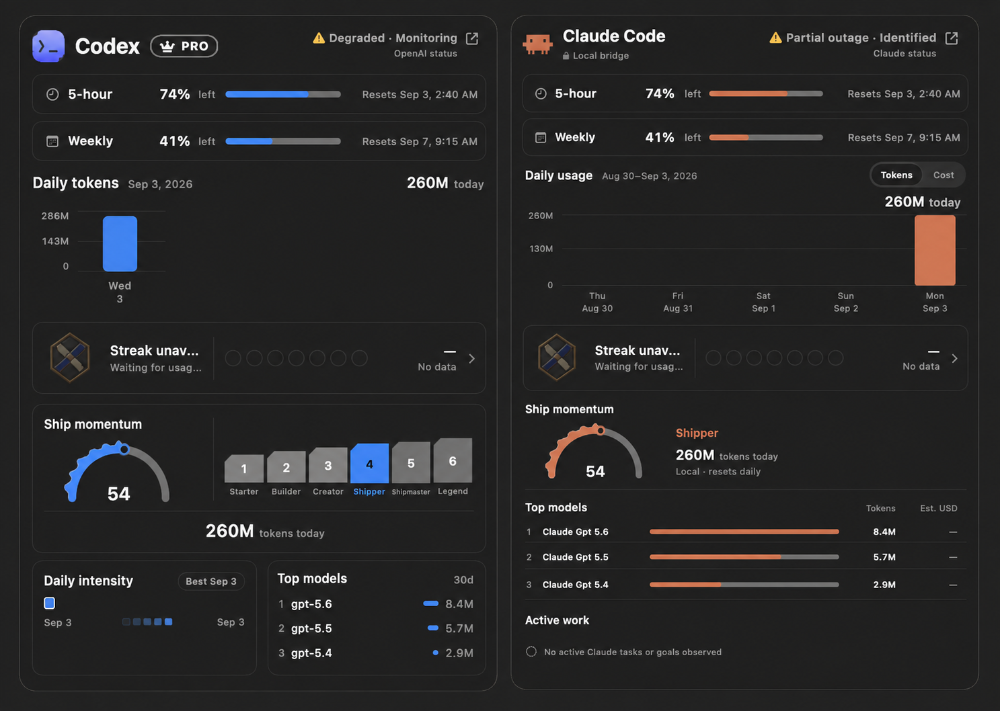
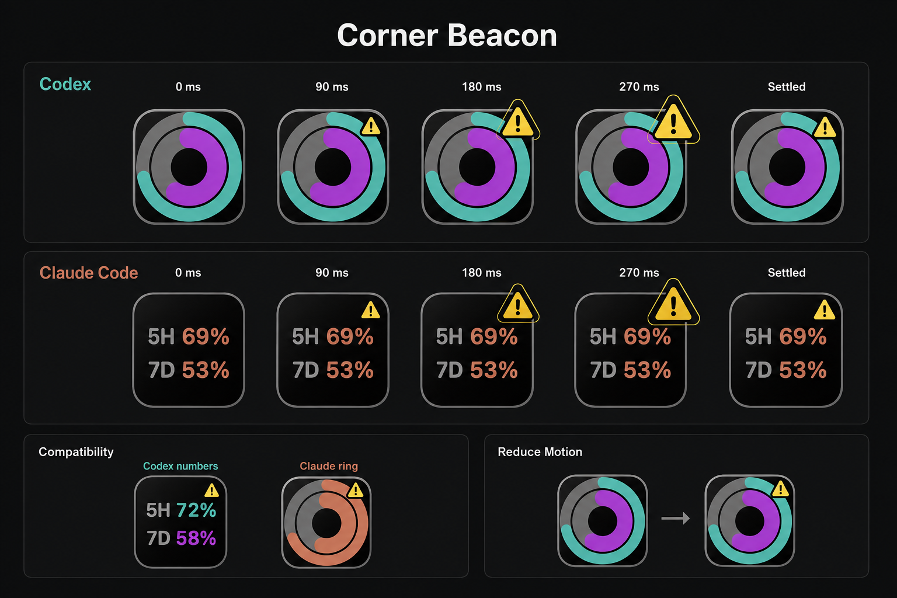

# Codex and Claude Service Status — Design Research

Date: 2026-09-03

This document records the selected dashboard and Dock directions, the provider
research, and the production behavior implemented in DockMagic.

## Selected dashboard direction

The selected direction is **Header Pulse**:



- Keep the existing usage dashboard and its visual hierarchy.
- Add one compact provider-health row in the Codex or Claude header.
- Show a semantic symbol, a short state label, the incident phase, and a link to
  the provider status page.
- Provider health and local usage freshness are separate states. A provider
  incident must never be inferred from a local authentication, parsing, or
  connectivity failure.

The existing 440-point hover panel retains its lifetime-usage metric, so the
status and official-status link use a compact second header line. This is the
responsive form of the selected concept and prevents either signal from being
truncated.

## Selected Dock direction

The selected direction is **Corner Beacon**:



- Keep usage rings and numbers stationary while a provider incident arrives.
- Bloom a semantic warning/danger triangle once over a 270 ms explicit frame
  sequence, then settle on the static top-right beacon.
- Animate only a new incident or severity increase. Phase-only refreshes do not
  replay the animation, and recovery removes the beacon without an alert.
- Reduce Motion skips the frame sequence and publishes the settled state.

## Data feasibility

The feature is feasible without credentials.

### Codex / OpenAI

- Primary source: [OpenAI Status](https://status.openai.com/).
- Machine-readable source: [OpenAI status RSS](https://status.openai.com/feed.rss).
- The public page is powered by incident.io. Its RSS entries expose the incident
  title, link, published time, incident phase, and affected component names.
- Only unresolved entries that explicitly affect a Codex component should
  change Codex health. ChatGPT-only or API-only incidents must not be promoted to
  Codex downtime.
- incident.io documents `Investigating`, `Identified`, `Monitoring`, and
  `Resolved` as incident phases, and confirms that public incident updates are
  available in RSS/Atom feeds:
  [publishing incidents](https://docs.incident.io/status-pages/publishing-incidents),
  [status subscriptions](https://docs.incident.io/status-pages/subscriptions).

The RSS format is provider-owned and may change, so parsing belongs behind a
small provider adapter with captured XML fixtures. A parse or network failure
maps to `unavailable`, never to `majorOutage`.

### Claude Code / Anthropic

- Primary source: [Claude Status](https://status.claude.com/).
- Public JSON sources:
  [summary](https://status.claude.com/api/v2/summary.json),
  [unresolved incidents](https://status.claude.com/api/v2/incidents/unresolved.json),
  [top-level status](https://status.claude.com/api/v2/status.json).
- The summary response includes a dedicated `Claude Code` component. At the time
  of research its component id was `yyzkbfz2thpt`; implementation should keep the
  id as the preferred selector and fall back to an exact normalized component
  name so a provider migration does not silently disable status.
- Use the component status for severity and the newest matching unresolved
  incident for the title and phase. Do not use the page-wide status when the
  `Claude Code` component is operational.
- Atlassian defines the component states as `operational`, `under_maintenance`,
  `degraded_performance`, `partial_outage`, and `major_outage`:
  [component status definitions](https://support.atlassian.com/statuspage/docs/what-is-a-component/).
  Its public Status API is intended for embedding service health in another app:
  [Status API overview](https://support.atlassian.com/statuspage/docs/what-are-the-different-apis-under-statuspage/).

## Normalized product model

```text
ServiceHealth
  provider: codex | claudeCode
  severity: operational | degraded | partialOutage | majorOutage | maintenance | unavailable
  phase: investigating | identified | monitoring | resolved | unknown
  incidentID: String?
  title: String?
  sourceURL: URL
  updatedAt: Date?
  fetchedAt: Date
```

Rules:

- `operational` is neutral; it does not add a persistent green accent.
- `degraded`, `partialOutage`, and `maintenance` use the shared warning role.
- `majorOutage` uses the shared danger role.
- `unavailable` means DockMagic cannot verify the provider state. It uses a
  neutral/stale treatment and must not look like confirmed downtime.
- Dashboard copy includes the phase because `Monitoring` is meaningfully
  different from an unresolved outage even when a component is still degraded.

## Fetch and cache policy

- Poll operational providers every 5 minutes and providers with an active
  incident every 60 seconds.
- Refresh on launch and after wake from sleep.
- Apply exponential retry backoff after transport failures, capped at 10
  minutes.
- Keep the last successful value for 10 minutes. After that, expose
  `unavailable` with its last-updated time.
- Cache the normalized value and incident signature, not raw provider markup.
- Deduplicate Dock animation by incident identity/title and severity. Animate
  only for a new incident or severity increase; repeated polling and phase-only
  changes only refresh the static frame.

## Dock rendering feasibility

The existing rendering path is compatible with a bounded status animation:

```text
ServiceStatusClient
  -> ServiceHealthStore
  -> DockAppModel.dockPresentation
  -> DockTilePresentation
  -> DockApplicationIconRenderer (stable raster frames)
  -> DockTileController (short explicit timeline)
```

`NSApplication.applicationIconImage` is the supported AppKit API for temporarily
changing an app icon in its Dock tile, and `NSDockTile.display()` requests a
redraw:
[applicationIconImage](https://developer.apple.com/documentation/appkit/nsapplication/applicationiconimage),
[NSDockTile](https://developer.apple.com/documentation/appkit/nsdocktile),
[display()](https://developer.apple.com/documentation/appkit/nsdocktile/display()).

DockMagic already renders a canonical 512-point image at 2x and installs it via
`applicationIconImage`. The clock feature already drives an explicit,
cancellable frame timeline, so the service transition can reuse this approach
without enabling implicit SwiftUI animation during rasterization.

The app intentionally leaves `NSDockTile.contentView` unset to preserve
Command-Tab quality. Service status must keep that invariant. Since the canonical
application icon is shared, the static alert state and transition frames will
also be visible in Command-Tab; this is consistent with the current product
behavior.

Alternatives considered:

- `NSDockTile.badgeLabel` is supported but its appearance is system-defined and
  accepts only a short string. It is viable as a fallback, but offers less visual
  control and does not fit the existing renderer as well.
- `requestUserAttention(.informationalRequest)` bounces the Dock icon and can
  remain active until activation or cancellation. It is too intrusive for a
  third-party incident and is not part of the proposed directions.

## Motion and accessibility contract

- Animate once on a meaningful state transition; do not loop for the duration of
  an incident.
- Keep the transition within the design-system motion budget: approximately
  0.24–0.36 seconds, rendered as a small number of deterministic frames.
- Settle on a static symbol so downtime remains legible after motion ends.
- If Reduce Motion is enabled, skip directly to the final static frame. AppKit
  exposes `accessibilityDisplayShouldReduceMotion` and a notification for changes:
  [Apple accessibility display option](https://developer.apple.com/documentation/appkit/nsworkspace/accessibilitydisplayshouldreducemotion).
- Never communicate health by color alone. The final frame needs a distinct
  symbol/shape at 32, 48, 64, and 128 points.
- Use existing semantic warning/danger roles. Do not add gradients, colored glow,
  tinted tile surfaces, or provider-color status treatments.
- The service indicator owns one status slot. Confirmed provider downtime takes
  precedence over local usage freshness in that slot; the dashboard still shows
  both states as separate text rows.

## Implemented production path

1. Provider adapters parse captured OpenAI RSS and Claude Statuspage JSON
   fixtures into one normalized model.
2. A shared store polls, retries, caches successful snapshots, refreshes after
   wake, and separates stale/unavailable transport state from confirmed outage.
3. Header Pulse is rendered in both dashboards and exported captures, with an
   actual link to the official provider status page.
4. Corner Beacon is rendered for both ring and numbers modes through the
   canonical 512-point/2x application-icon pipeline.
5. The Dock controller owns a cancellable nine-frame timeline and honors the
   system Reduce Motion preference.
6. Automated snapshots cover Light, Dark, Increased Contrast, Reduce
   Transparency, Reduce Motion, grayscale, and 32/48/64/128-point Dock sizes.
